# MindWeave Complete Component Inventory

**Date:** 2026-04-01
**Total Screens:** 46 functional (49 total - 3 empty)
**Purpose:** Deep dive component analysis for all screens

---

## Global Component Library

### Buttons

| Component | Variants | Usage |
| --------- | -------- | ----- |
| Primary Button | `bg-gradient-to-r from-primary to-primary-container`, rounded-full, px-6 py-2 | CTAs, main actions |
| Secondary Button | outlined, border-on-surface-variant | Secondary actions |
| Icon Button | material-symbols-outlined, text-4xl | Player controls, navigation |
| Text Button | text-primary hover:text-primary-container | Links, subtle actions |
| Ghost Button | bg-transparent hover:bg-surface-variant | Toolbar actions |
| Floating Action Button | fixed position, rounded-full, shadow-lg | Primary screen actions |

### Inputs

| Component | Variants | Usage |
| --------- | -------- | ----- |
| Text Field | border rounded-lg px-4 py-2 | Form inputs |
| Search Field | with search icon prefix | Search functionality |
| Number Input | with +/- steppers | Frequency, volume inputs |
| Slider | `type="range"`, custom styled | Volume, progress |
| Toggle Switch | custom toggle styling | Settings on/off |
| Checkbox | custom checkbox styling | Multi-select |
| Radio Button | custom radio styling | Single select |

### Cards

| Component | Variants | Usage |
| --------- | -------- | ----- |
| Preset Card | rounded-xl, shadow, hover:scale | Library grid items |
| Info Card | rounded-lg, bg-surface-variant | Info displays |
| Feature Card | with icon, title, description | Frequencies, education |
| Stat Card | compact, numeric display | Stats, metrics |

### Navigation

| Component | Variants | Usage |
| --------- | -------- | ----- |
| Bottom Tab Bar | fixed bottom, 4-5 items | Mobile navigation |
| Sidebar | fixed left, collapsible | Desktop navigation |
| Top App Bar | fixed top, with actions | Header, context actions |
| Breadcrumbs | text-sm, separator | Deep navigation |
| Back Button | material icon "arrow_back" | Return navigation |

### Feedback

| Component | Variants | Usage |
| --------- | -------- | ----- |
| Toast/Snackbar | slide up, auto-dismiss | Success, error messages |
| Modal Dialog | centered, overlay | Confirmations, forms |
| Bottom Sheet | slide up from bottom | Mobile actions, options |
| Progress Bar | linear, circular | Loading, progress |
| Skeleton Loader | animated pulse | Content loading |
| Badge | small dot or number | Notifications, counts |

### Data Display

| Component | Variants | Usage |
| --------- | -------- | ----- |
| List Item | with icon, title, subtitle | Menu items, settings |
| Grid Item | square aspect, overlay text | Gallery, presets |
| Timeline Item | connected dots | Session history |
| Chart/Graph | bar, line, pie | Statistics, reports |
| Avatar | circular image | User profile |
| Divider | horizontal/vertical line | Section separation |
| **Accordion** | single/multi expand | FAQ, settings sections |
| **Table** | sortable, striped | Ledger, data lists |
| **Tree** | expandable nodes | Nested categories |
| **Carousel** | horizontal scroll | Onboarding, recommendations |
| **Tabs** | horizontal, vertical | Content switching |
| **ExpansionPanel** | collapsible sections | Settings groups |

### Feedback (Additional)

| Component | Variants | Usage |
| --------- | -------- | ----- |
| **Tooltip** | hover, focus, persistent | Help text, explanations |
| **Alert** | info, success, warning, error | Inline notifications |
| **ConfirmationDialog** | danger, neutral | Destructive actions |
| **Popover** | hover, click triggered | Contextual info, previews |
| **LoadingOverlay** | full-screen, inline | Blocking operations |
| **NotificationCenter** | list, badge | System notifications UI |

### Inputs (Additional)

| Component | Variants | Usage |
| --------- | -------- | ----- |
| **Dropdown/Select** | single, multi, searchable | Device selection, sorting |
| **DatePicker** | calendar, range | Journal dates, filters |
| **Stepper** | horizontal, vertical | Numeric inputs |
| **SegmentedControl** | icon, text | Grid/List toggle |
| **ColorPicker** | preset, custom | Theme customization |

### Navigation (Additional)

| Component | Variants | Usage |
| --------- | -------- | ----- |
| **Drawer** | left, right, temporary | Mobile navigation |
| **Menu** | context, dropdown | Right-click actions |
| **Pagination** | numbered, infinite | Lists, grids |
| **StepIndicator** | horizontal, vertical | Onboarding, payment flow |
| **Breadcrumb** | with icons, text | Deep navigation |

### Accessibility Components

| Component | Variants | Usage |
| --------- | -------- | ----- |
| **FocusTrap** | modal, dialog | Keyboard focus containment |
| **SkipLink** | visible on focus | Keyboard navigation |
| **LiveRegion** | polite, assertive | Screen reader announcements |
| **ScreenReaderOnly** | visually hidden | Context for screen readers |
| **VisuallyHidden** | accessible only | Hidden labels |

---

## Design Tokens

### Color Palette

**Primary Colors:**

| Token | Light Mode | Dark Mode | Usage |
| ------- | ---------- | --------- | ----- |
| `primary` | #6750A4 | #D0BCFF | Main brand color |
| `primary-container` | #EADDFF | #4F378B | Button backgrounds |
| `on-primary` | #FFFFFF | #381E72 | Text on primary |
| `on-primary-container` | #21005D | #EADDFF | Text on primary container |

**Surface Colors:**

| Token | Light Mode | Dark Mode | Usage |
| ------- | ---------- | --------- | ----- |
| `surface` | #FFFBFE | #1C1B1F | Main background |
| `surface-variant` | #E7E0EC | #49454F | Secondary background |
| `surface-tint` | #6750A4 | #D0BCFF | Overlay tint |
| `background` | #FFFBFE | #1C1B1F | Canvas background |

**Semantic Colors:**

| Token | Light Mode | Dark Mode | Usage |
| ------- | ---------- | --------- | ----- |
| `error` | #B3261E | #F2B8B5 | Error states |
| `success` | #2E7D32 | #81C784 | Success states |
| `warning` | #ED6C02 | #FFB74D | Warning states |
| `info` | #0288D1 | #4FC3F7 | Info states |

### Typography Scale

| Token | Size | Weight | Line Height | Usage |
| ------- | ------ | ------ | ----------- | ----- |
| `display-large` | 57px | 400 | 64px | Hero text |
| `display-medium` | 45px | 400 | 52px | Large headers |
| `display-small` | 36px | 400 | 44px | Medium headers |
| `headline-large` | 32px | 400 | 40px | Page titles |
| `headline-medium` | 28px | 400 | 36px | Section titles |
| `headline-small` | 24px | 400 | 32px | Card titles |
| `title-large` | 22px | 400 | 28px | App bar titles |
| `title-medium` | 16px | 500 | 24px | Subsection titles |
| `title-small` | 14px | 500 | 20px | List titles |
| `body-large` | 16px | 400 | 24px | Primary body text |
| `body-medium` | 14px | 400 | 20px | Secondary body text |
| `body-small` | 12px | 400 | 16px | Captions |
| `label-large` | 14px | 500 | 20px | Button text |
| `label-medium` | 12px | 500 | 16px | Small buttons |
| `label-small` | 11px | 500 | 16px | Badges |

### Spacing Scale

| Token | Value | Usage |
| ------- | ------- | ------- |
| `space-0` | 0px | No space |
| `space-1` | 4px | Tight gaps |
| `space-2` | 8px | Default small |
| `space-3` | 12px | Medium small |
| `space-4` | 16px | Default medium |
| `space-5` | 20px | Medium large |
| `space-6` | 24px | Default large |
| `space-8` | 32px | Extra large |
| `space-10` | 40px | Section gaps |
| `space-12` | 48px | Large sections |
| `space-16` | 64px | Page sections |
| `space-20` | 80px | Major sections |
| `space-24` | 96px | Page breaks |

### Border Radius

| Token | Value | Usage |
| ------- | ------- | ------- |
| `radius-none` | 0px | No rounding |
| `radius-sm` | 4px | Small elements |
| `radius-md` | 8px | Default rounding |
| `radius-lg` | 12px | Cards, dialogs |
| `radius-xl` | 16px | Large cards |
| `radius-2xl` | 24px | Modals |
| `radius-full` | 9999px | Pills, circles |

### Elevation/Shadows

| Token | Value | Usage |
| ------- | ------- | ------- |
| `shadow-0` | none | Flat elements |
| `shadow-1` | 0 1px 3px rgba(0,0,0,0.12) | Subtle lift |
| `shadow-2` | 0 4px 6px rgba(0,0,0,0.1) | Cards at rest |
| `shadow-3` | 0 10px 15px rgba(0,0,0,0.1) | Cards hovered |
| `shadow-4` | 0 20px 25px rgba(0,0,0,0.15) | Modals |
| `shadow-5` | 0 25px 50px rgba(0,0,0,0.25) | Fullscreen dialogs |

---

### Category 1: Core Navigation (1 screen)

#### Screen: Main Navigation Shell

**Stitch ID:** N/A (Code)
**Platform:** Mobile (Bottom Tab) + Desktop (Sidebar)

**Components:**

**Mobile Layout:**

```text
┌─────────────────────────────────────┐
│  [Screen Content Area]              │
│                                     │
│                                     │
├─────────────────────────────────────┤
│  [🏠]  [📚]  [🧘]  [🌊]  [📓]     │
│  Home  Lib   Play  Freq  Journal   │
└─────────────────────────────────────┘
```text

**Components:**

- **BottomNavigationBar** (Fixed height: 64px)
  - 5x `NavigationItem`
    - Icon: material-symbols-outlined, 24px
    - Label: text-xs, font-medium
    - State: selected (filled icon + primary color) / unselected (outlined + on-surface-variant)
    - Ripple effect on tap
  - Background: bg-surface with top border or shadow
  - Safe area padding for notched devices

**Desktop Layout:**

```text
┌─────────────────────────────────────────────────────────┐
│  [Logo]                    [Search] [Profile] [⚙️]     │ <- Top App Bar
├──────────┬─────────────────────────┬──────────────────┤
│          │                         │                  │
│  Library │      Sanctuary          │   Frequencies    │
│  Panel   │      (Player)           │   or Journal     │
│          │                         │                  │
├──────────┴─────────────────────────┴──────────────────┤
│  Status Bar / Now Playing                             │
└─────────────────────────────────────────────────────────┘
```text

**Components:**

- **Top App Bar** (Height: 56px)
  - Logo: MindWeave wordmark or icon
  - Search Button: Icon button with search icon
  - Profile Button: Avatar or user icon
  - Settings Button: gear icon
  
- **Sidebar** (Width: 280px, collapsible to 72px)
  - Logo section (collapsed: icon only)
  - Navigation Items:
    - Library: book icon
    - Sanctuary: spa/waves icon (highlighted as active)
    - Frequencies: water/wave icon
    - Journal: calendar icon
  - Section dividers
  - Collapse/Expand toggle

- **Panel Area** (Flexible width)
  - Left Panel: Library/Community (draggable width)
  - Center Panel: Sanctuary Player (fixed min-width)
  - Right Panel: Frequencies/Journal/Details

---

### Category 2: Sanctuary/Player (5 screens)

#### Screen: Desktop Player Dashboard

**Stitch ID:** `38e69fdf5d6e4bc0a715d04a2067a504`
**Platform:** Desktop

**Full Component Tree:**

```text
DesktopPlayerDashboard
├── TopAppBar
│   ├── Logo (MindWeave)
│   ├── SearchButton
│   ├── ProfileButton
│   └── SettingsButton
├── MainContent (3-column layout)
│   ├── LeftPanel (Library Panel)
│   │   ├── PanelHeader
│   │   │   ├── Title: "Library"
│   │   │   └── ViewToggle (Grid/List)
│   │   ├── TabBar
│   │   │   ├── Tab: "My Favorites" (active)
│   │   │   └── Tab: "Community"
│   │   ├── PresetGrid
│   │   │   └── PresetCard (multiple)
│   │   │       ├── PresetImage (cover)
│   │   │       ├── Title
│   │   │       ├── BandBadge
│   │   │       └── Duration
│   │   └── AddButton (FAB)
│   ├── CenterPanel (Player)
│   │   ├── VisualizerArea
│   │   │   ├── FrequencyVisualizer (canvas)
│   │   │   ├── BackgroundGradient
│   │   │   └── ParticleEffects (optional)
│   │   ├── PresetInfo
│   │   │   ├── PresetName (large heading)
│   │   │   ├── BandLabel (secondary)
│   │   │   └── Description
│   │   ├── PlaybackControls
│   │   │   ├── PreviousButton (skip_previous)
│   │   │   ├── PlayPauseButton (large, centered)
│   │   │   │   ├── PlayIcon (play_arrow)
│   │   │   │   └── PauseIcon (pause) [when playing]
│   │   │   └── NextButton (skip_next)
│   │   ├── SlidersSection
│   │   │   ├── BinauralVolume
│   │   │   │   ├── Label: "Binaural"
│   │   │   │   ├── Value: "7.83 Hz"
│   │   │   │   └── Slider
│   │   │   ├── CarrierVolume
│   │   │   │   ├── Label: "Carrier"
│   │   │   │   ├── Value: "200 Hz"
│   │   │   │   └── Slider
│   │   │   └── NoiseVolume
│   │   │       ├── Label: "Pink Noise"
│   │   │       ├── Value: "40%"
│   │   │       └── Slider
│   │   └── SecondaryControls
│   │       ├── TimerButton (timer icon)
│   │       ├── MixerButton (tune icon)
│   │       ├── FavoriteButton (star icon)
│   │       └── ShareButton (share icon)
│   └── RightPanel (Frequencies/Journal toggle)
│       ├── PanelToggle
│       │   ├── Button: "Frequencies"
│       │   └── Button: "Journal"
│       └── ContentArea
│           └── [FrequenciesContent or JournalContent]
└── SupportBanner
    ├── Text: "Support MindWeave"
    ├── ProgressBar (funding goal)
    └── DonateButton
```text

**All Components Identified:**

**Layout Components:**

1. `TopAppBar` - Fixed header with actions
2. `ResizablePanel` - Left/right panels with drag handles
3. `PanelHeader` - Section headers with actions
4. `TabBar` - Navigation tabs within panels

**Input Components:**
5. `IconButton` - Various icon buttons (24px)
6. `PlayPauseButton` - Large primary action (64px)
7. `Slider` - Custom styled range inputs
8. `ViewToggle` - Grid/List switch

**Display Components:**
9. `PresetCard` - Grid item with image and info
10. `BandBadge` - Chip showing brainwave band
11. `FrequencyVisualizer` - Canvas-based animation
12. `ProgressBar` - Linear progress indicator

**Navigation Components:**
13. `PanelToggle` - Switch between right panel views

**Overlay/Modal Triggers:**
14. `TimerButton` - Opens timer overlay
15. `MixerButton` - Opens mixer overlay
16. `SearchButton` - Opens search modal

**States:**

- Playing: Visualizer active, Pause icon shown, sliders enabled
- Paused: Visualizer static, Play icon shown
- Loading: Skeleton or spinner on visualizer
- Error: Toast notification

---

#### Screen: Deep Flow Immersion (Fullscreen)

**Stitch ID:** `c1072632d4f046ed8f37cacbc79a7e56`
**Platform:** Desktop

**Component Tree:**

```text
DeepFlowImmersion
├── FullscreenContainer
│   ├── BackgroundLayer
│   │   ├── AnimatedGradient
│   │   └── ParticleSystem
│   ├── VisualizerLayer
│   │   └── FrequencyVisualizer (maximized)
│   └── ControlOverlay (fades after 3s inactivity)
│       ├── TopBar
│       │   ├── ExitButton (close icon)
│       │   └── Title: Current Preset
│       ├── BottomBar
│       │   ├── PlayPauseButton (large)
│       │   ├── ProgressBar (scrubbable)
│       │   ├── TimerDisplay
│       │   └── VolumeSlider
│       └── QuickActions (on hover)
│           ├── SkipPrevious
│           ├── SkipNext
│           ├── Favorite
│           └── Settings
```text

**Components:**

1. `FullscreenContainer` - 100vh, 100vw, black bg
2. `AnimatedGradient` - CSS animated background
3. `ParticleSystem` - Canvas overlay
4. `FrequencyVisualizer` - Full-size canvas
5. `FadeOverlay` - Auto-hiding controls
6. `ProgressBar` - With time tooltip
7. `TimerDisplay` - Countdown or elapsed time

**Interactions:**

- Mouse move: Show controls temporarily
- Double click: Toggle fullscreen
- ESC key: Exit immersion mode
- Spacebar: Play/Pause
- Arrow keys: Skip tracks, adjust volume

---

#### Screen: Sleep Timer Picker (Mobile)

**Stitch ID:** `f9b4848712d8437580f510aea5eacf94`
**Platform:** Mobile

**Component Tree:**

```text
SleepTimerPicker (Bottom Sheet)
├── SheetHeader
│   ├── DragHandle
│   ├── Title: "Sleep Timer"
│   └── CloseButton
├── PresetDurations
│   ├── QuickChip: "15 min"
│   ├── QuickChip: "30 min"
│   ├── QuickChip: "45 min"
│   ├── QuickChip: "1 hour"
│   └── CustomChip: "Custom..."
├── CustomDuration (expandable)
│   ├── HourPicker (0-12)
│   ├── MinutePicker (0-59)
│   └── PresetLabelInput
├── FadeOptions
│   ├── Title: "Fade Out"
│   ├── Checkbox: "Gradual fade (last 5 min)"
│   └── Checkbox: "Stop immediately"
└── ActionBar
    ├── CancelButton
    └── StartTimerButton (primary)
```text

**Components:**

1. `BottomSheet` - Slide up modal
2. `DragHandle` - Visual handle for sheet
3. `DurationChip` - Quick select buttons
4. `TimePicker` - Wheel picker for custom time
5. `TextField` - Label input
6. `Checkbox` - Options with labels
7. `ActionBar` - Bottom action buttons

**States:**

- Collapsed: Quick chips visible
- Custom: Time pickers shown
- Active: Timer running, shows countdown

---

### Category 3: Library/Favorites (5 screens)

#### Screen: Desktop Library Dashboard

**Stitch ID:** `c5e5e201b0d0418fb0f312141fa16e3d`
**Platform:** Desktop

**Component Tree:**

```text
DesktopLibraryDashboard
├── TopBar
│   ├── Title: "My Library"
│   ├── ViewToggle (Grid/List)
│   └── SortDropdown
│       ├── "Recently Added"
│       ├── "Alphabetical"
│       ├── "Most Played"
│       └── "Band Type"
├── TabBar
│   ├── Tab: "My Favorites" (count badge)
│   └── Tab: "Community"
├── ContentArea
│   ├── EmptyState (if no favorites)
│   │   ├── Icon: empty_favorites
│   │   ├── Title: "No favorites yet"
│   │   ├── Subtitle: "Save presets you love"
│   │   └── BrowseButton
│   └── GridView (default)
│       └── PresetCard (repeated)
│           ├── CoverImage (1:1 aspect)
│           ├── HoverOverlay
│           │   ├── PlayButton
│           │   ├── QuickActions
│           │   │   ├── EditButton
│           │   │   ├── DeleteButton
│           │   │   └── ShareButton
│           └── InfoOverlay
│               ├── Title
│               ├── BandBadge
│               └── Duration
├── RightPanel (Detail View - when selected)
│   ├── PresetDetailHeader
│   │   ├── LargeCover
│   │   ├── Title (editable)
│   │   └── ActionsRow
│   │       ├── PlayButton
│   │       ├── FavoriteButton (filled)
│   │       └── ShareButton
│   ├── SettingsSection
│   │   ├── FrequencySlider
│   │   ├── CarrierSlider
│   │   ├── NoiseTypeDropdown
│   │   └── NoiseVolumeSlider
│   ├── DescriptionField
│   └── Metadata
│       ├── Created date
│       ├── Last played
│       └── Play count
└── FAB (Add New)
```text

**Components:**

1. `ViewToggle` - Grid/List segmented control
2. `SortDropdown` - Popover menu
3. `EmptyState` - Illustration + CTA
4. `PresetCard` - With hover interactions
5. `HoverOverlay` - Contextual actions on hover
6. `QuickActions` - Edit/Delete/Share buttons
7. `BandBadge` - Color-coded chip
8. `DetailPanel` - Right side expandable panel
9. `FAB` - Floating action button

**Interactions:**

- Click card: Load and play preset
- Hover card: Show overlay actions
- Long press (mobile): Context menu
- Drag and drop: Reorder favorites (desktop)
- Double-click: Open detail view

---

#### Screen: Favorite Nodes Gallery (Mobile)

**Stitch ID:** `45c8228f3f104484b310baa89a7f3618`
**Platform:** Mobile

**Component Tree:**

```text
FavoriteNodesGallery
├── AppBar
│   ├── BackButton
│   ├── Title: "My Favorites"
│   └── SearchButton
├── FilterChips (horizontal scroll)
│   ├── Chip: "All" (selected)
│   ├── Chip: "Delta"
│   ├── Chip: "Theta"
│   ├── Chip: "Alpha"
│   ├── Chip: "Beta"
│   └── Chip: "Gamma"
├── GridContent
│   └── PresetCard (repeated)
│       ├── CoverImage
│       ├── Title (below image)
│       └── BandBadge
├── EmptyState (conditional)
└── FAB (Add)
```text

**Components:**

1. `FilterChips` - Horizontal scrollable chips
2. `Chip` - Active/Inactive states
3. `Grid` - Masonry or fixed grid layout
4. `PresetCard` - Mobile-optimized touch targets

---

#### Screen: Favorite Nodes Dashboard (Full View)

**Stitch ID:** `64510d005a3d4562b243bac1970ffeae`
**Platform:** Desktop

**Component Tree:**

```text
FavoriteNodesDashboard
├── Header
│   ├── Title: "Favorite Nodes"
│   ├── Subtitle: "Your curated collection"
│   └── StatsRow
│       ├── TotalCount
│       ├── PlayTime
│       └── LastAdded
├── FilterBar
│   ├── SearchField
│   ├── BandFilterDropdown
│   ├── SortDropdown
│   └── ViewToggle
├── MainGrid (large cards)
│   └── LargePresetCard
│       ├── HeroImage (16:9)
│       ├── ContentOverlay
│       │   ├── Title
│       │   ├── Description
│       │   └── BandBadge
│       └── ActionBar
│           ├── PlayButton (primary)
│           ├── QueueButton
│           ├── EditButton
│           └── DeleteButton
└── Sidebar
    ├── QuickFilters
    │   ├── "Recently Played"
    │   ├── "Most Played"
    │   └── "Created by Me"
    └── RecommendedSection
        └── SuggestedPresets (community)
```text

**Components:**

1. `StatsRow` - Metric display
2. `LargePresetCard` - Featured card format
3. `HeroImage` - 16:9 aspect ratio
4. `QuickFilters` - Sidebar shortcuts
5. `RecommendedSection` - Suggestions

---

### Category 4: Community Presets (4 screens)

#### Screen: Desktop Community Hub

**Stitch ID:** `589ffe27f2774fb0844f784803ddb08d`
**Platform:** Desktop

**Component Tree:**

```text
DesktopCommunityHub
├── Header
│   ├── Title: "Community Hub"
│   ├── Subtitle: "Discover presets from the community"
│   └── SearchBar (full width)
├── FilterSection
│   ├── PopularTags (horizontal scroll)
│   │   ├── Tag: "Sleep"
│   │   ├── Tag: "Focus"
│   │   ├── Tag: "Meditation"
│   │   └── Tag: "..."
│   └── SortOptions
│       ├── "Trending"
│       ├── "Newest"
│       └── "Most Played"
├── ContentGrid
│   └── CommunityPresetCard
│       ├── CoverImage
│       ├── AuthorAvatar + Name
│       ├── PresetTitle
│       ├── Description (truncated)
│       ├── StatsRow
│       │   ├── PlayCount
│       │   ├── FavoriteCount
│       │   └── CommentCount
│       └── ActionBar
│           ├── PreviewButton
│           ├── SaveButton
│           └── ShareButton
├── LoadMoreTrigger (infinite scroll)
└── RightPanel (Preview)
    └── CommunityPresetDetail (when selected)
```text

**Components:**

1. `Tag` - Clickable filter chips
2. `CommunityPresetCard` - With social metrics
3. `AuthorAvatar` - Small circular profile image
4. `StatsRow` - Social proof metrics
5. `InfiniteScroll` - Load more trigger

---

### Category 5: Frequencies (4 screens)

#### Screen: Frequency Soundscapes Explorer

**Stitch ID:** `9438caf7ea44412895d66f99efe70f2e`
**Platform:** Desktop

**Component Tree:**

```text
FrequencySoundscapesExplorer
├── HeroSection
│   ├── Title: "Frequency Soundscapes"
│   ├── Subtitle: "Explore the science of brainwave entrainment"
│   └── VisualElement (wave animation)
├── BandSelector (sticky)
│   ├── BandTab: "Delta" (0.5-4 Hz) - Deep Sleep
│   ├── BandTab: "Theta" (4-8 Hz) - Meditation
│   ├── BandTab: "Alpha" (8-13 Hz) - Relaxation
│   ├── BandTab: "Beta" (13-30 Hz) - Focus
│   └── BandTab: "Gamma" (30-100 Hz) - Peak Performance
├── ContentSection (per band)
│   ├── BandHeader
│   │   ├── FrequencyRange
│   │   ├── PrimaryBenefits
│   │   └── PlaySampleButton
│   ├── EducationalContent
│   │   ├── WhatIsSection
│   │   ├── BenefitsGrid
│   │   │   └── BenefitCard (icon + title + description)
│   │   └── ScienceSection
│   │       ├── BrainwaveChart
│   │       └── ExplanationText
│   ├── UseCases
│   │   └── UseCaseCard (scenario-based)
│   └── PresetRecommendations
│       └── RelatedPresets (horizontal scroll)
└── DeepDiveCTA
    └── Button: "Learn more about [Band]"
```text

**Components:**

1. `BandSelector` - Sticky tab navigation
2. `BandTab` - With frequency range
3. `BenefitCard` - Icon + title + description
4. `BrainwaveChart` - Visual diagram
5. `UseCaseCard` - Scenario illustrations
6. `PresetRecommendations` - Related content carousel

---

#### Screen: The Science of Binaural Beats

**Stitch ID:** `73d8fa317e7141cab40c09915e0a567c`
**Platform:** Desktop

**Component Tree:**

```text
ScienceOfBinauralBeats
├── ArticleHeader
│   ├── Breadcrumb: Home > Frequencies > Science
│   ├── Title: "The Science of Binaural Beats"
│   ├── Subtitle: "How auditory illusions affect brain states"
│   └── Author + Date
├── ArticleContent
│   ├── IntroductionSection
│   ├── HowItWorksSection
│   │   ├── InteractiveDiagram
│   │   └── ExplanationSteps
│   ├── FrequencyChart
│   │   ├── VisualSpectrum
│   │   └── BandLabels
│   ├── ResearchSection
│   │   └── StudyCard (citation + findings)
│   └── ReferencesList
└── RelatedContent
    └── ReadMoreLinks
```text

---

### Category 6: Journals/History (5 screens)

#### Screen: Celestial Journal (Desktop)

**Stitch ID:** `8de4afd17d224df088cb63c267810128`
**Platform:** Desktop

**Component Tree:**

```text
CelestialJournal
├── Sidebar
│   ├── JournalStats
│   │   ├── TotalSessions
│   │   ├── TotalMinutes
│   │   └── CurrentStreak
│   ├── CalendarView
│   │   └── MiniCalendar (with session dots)
│   └── QuickFilters
│       ├── "This Week"
│       ├── "This Month"
│       └── "All Time"
├── MainContent
│   ├── Header
│   │   ├── Title: "Session Journal"
│   │   ├── DateRangeSelector
│   │   └── ExportButton
│   ├── ViewToggle (List/Calendar/Stats)
│   ├── SessionList (List View)
│   │   └── SessionCard
│   │       ├── DateHeader (grouped by date)
│   │       ├── SessionRow
│   │       │   ├── Time
│   │       │   ├── PresetName
│   │       │   ├── Duration
│   │       │   ├── MoodRating (if recorded)
│   │       │   └── Actions (edit/note)
│   │       └── DaySummary
│   ├── CalendarView (alternative)
│   │   └── CalendarGrid
│   │       └── DayCell
│   │           ├── DateNumber
│   │           ├── SessionDots
│   │           └── TotalTime
│   └── StatsView (alternative)
│       ├── ChartsSection
│       │   ├── WeeklyChart
│       │   ├── MonthlyChart
│       │   └── BandDistribution
│       └── InsightsSection
└── DetailPanel (when session selected)
    ├── SessionDetails
    │   ├── DateTime
    │   ├── PresetUsed
    │   ├── Duration
    │   └── SettingsSnapshot
    ├── MoodEntry (if exists)
    │   ├── Rating
    │   └── Notes
    └── NotesSection
        ├── TextArea (editable)
        └── SaveButton
```text

**Components:**

1. `MiniCalendar` - Compact month view
2. `SessionCard` - Journal entry
3. `MoodRating` - Star or emoji rating
4. `CalendarGrid` - Full month view
5. `DayCell` - With session indicators
6. `BandDistribution` - Pie/donut chart
7. `InsightsSection` - AI-generated insights

---

### Category 7: Settings (4 screens)

#### Screen: Desktop Settings & Support

**Stitch ID:** `cee726b269ec4c05b00cf7108a4d9a40`
**Platform:** Desktop

**Component Tree:**

```text
DesktopSettingsSupport
├── Sidebar (Categories)
│   ├── AccountSection
│   │   ├── Profile (avatar + name)
│   │   └── SignOut
│   ├── SettingsCategories
│   │   ├── Item: Audio Settings
│   │   ├── Item: Notifications
│   │   ├── Item: Appearance
│   │   ├── Item: Language
│   │   ├── Item: Storage
│   │   └── Item: About
│   └── SupportSection
│       ├── Item: Help Center
│       ├── Item: Contact Us
│       ├── Item: Report Bug
│       └── Item: Feature Request
├── MainPanel (Settings Content)
│   ├── AudioSettings
│   │   ├── Section: Default Quality
│   │   │   └── RadioGroup (Standard/High/Ultra)
│   │   ├── Section: Audio Output
│   │   │   └── Dropdown (device selection)
│   │   ├── Section: Volume Defaults
│   │   │   └── Sliders (binaural/carrier/noise)
│   │   └── Section: Auto-fade
│   │       └── Toggle
│   ├── Notifications
│   │   ├── Section: Session Reminders
│   │   │   └── Toggle + TimePicker
│   │   ├── Section: Daily Summary
│   │   │   └── Toggle
│   │   └── Section: Community Updates
│   │       └── Toggle
│   └── [Other Categories...]
└── HelpPanel (contextual)
    └── HelpContent (for selected setting)
```text

**Components:**

1. `SettingsSidebar` - Category navigation
2. `SettingsSection` - Grouped settings
3. `RadioGroup` - Single select options
4. `TimePicker` - Notification time
5. `HelpPanel` - Contextual documentation

---

#### Screen: Settings & Donation (Mobile)

**Stitch ID:** `2b43b2547c5646f799c0388d63dbc0cc`
**Platform:** Mobile

**Component Tree:**

```text
SettingsDonation (Scrollable)
├── ProfileSection
│   ├── Avatar (large, tap to edit)
│   ├── DisplayName
│   ├── Email
│   └── EditProfileButton
├── AccountSection
│   ├── MenuItem: Subscription
│   ├── MenuItem: Payment Methods
│   └── MenuItem: Data Export
├── PreferencesSection
│   ├── MenuItem: Audio Settings
│   ├── MenuItem: Notifications
│   ├── MenuItem: Language
│   └── MenuItem: Theme
├── SupportSection
│   ├── MenuItem: Help & FAQ
│   ├── MenuItem: Contact Support
│   └── MenuItem: Report a Bug
├── LegalSection
│   ├── MenuItem: Privacy Policy
│   ├── MenuItem: Terms of Service
│   └── MenuItem: Open Source
└── DonationSection (sticky at bottom)
    ├── Header: "Support MindWeave"
    ├── Description
    ├── ProgressBar (goal)
    ├── QuickAmounts
    │   ├── Chip: "$5"
    │   ├── Chip: "$10"
    │   └── Chip: "$25"
    └── DonateButton (primary)
```text

**Components:**

1. `ProfileSection` - Avatar + info
2. `MenuItem` - List tile with chevron
3. `DonationSection` - Sticky CTA
4. `ProgressBar` - Funding goal
5. `QuickAmounts` - Donation presets

---

### Category 8: Onboarding/Auth (4 screens)

#### Screen: Welcome Screen

**Stitch ID:** `2255ee4550b94195a3c611a29280f296`
**Platform:** Mobile + Desktop

**Component Tree:**

```text
WelcomeScreen
├── BackgroundLayer
│   ├── GradientBackground
│   └── ParticleAnimation (subtle)
├── ContentLayer
│   ├── Logo (large, centered)
│   ├── Tagline: "Your sanctuary for mind wellness"
│   ├── Description: "Discover the power of binaural beats..."
│   └── FeatureHighlights (3 items)
│       ├── Icon + "Science-backed frequencies"
│       ├── Icon + "Personalized experience"
│       └── Icon + "Private by design"
├── ActionArea
│   ├── PrimaryButton: "Get Started"
│   ├── SecondaryButton: "Sign In" (if returning user)
│   └── TextLink: "Continue as Guest"
└── Footer
    └── TextLink: "Privacy Policy" + "Terms of Service"
```text

---

#### Screen: Onboarding - How It Works

**Stitch ID:** `62a772c1432949998be594e440574ad1`
**Platform:** Mobile + Desktop

**Component Tree:**

```text
OnboardingFlow (3-4 pages)
├── PageIndicator (dots, 3-4)
├── Carousel/SlideContainer
│   ├── Slide 1: What are Binaural Beats?
│   │   ├── Illustration (brain + waves)
│   │   ├── Title: "Science of Sound"
│   │   └── Description
│   ├── Slide 2: Brainwave Bands
│   │   ├── Illustration (5 frequency ranges)
│   │   ├── Title: "Five Frequencies"
│   │   └── Description
│   ├── Slide 3: Your Journey
│   │   ├── Illustration (calendar/progress)
│   │   ├── Title: "Track Your Progress"
│   │   └── Description
│   └── Slide 4: Community (optional)
│       ├── Illustration (people/sharing)
│       ├── Title: "Join the Community"
│       └── Description
├── NavigationButtons
│   ├── SkipLink (top right)
│   ├── BackButton (if not first slide)
│   └── NextButton / GetStartedButton (last slide)
└── ProgressIndicator (linear alternative to dots)
```text

---

#### Screen: Permission Requests

**Stitch ID:** `c1072632d4f046ed8f37cacbc79a7e56`
**Platform:** Mobile (Native Dialogs) + Desktop (Custom Dialogs)

**Component Tree:**

```text
PermissionRequest (Sequential)
├── NotificationPermission
│   ├── Icon: notifications
│   ├── Title: "Stay on Track"
│   ├── Description: "Get reminders for your sessions"
│   ├── PermissionToggle
│   └── Buttons: "Allow" / "Not Now"
├── AudioPermission (Required)
│   ├── Icon: volume_up
│   ├── Title: "Audio Access"
│   ├── Description: "MindWeave needs audio access to play binaural beats"
│   └── Button: "Grant Access" (triggers OS dialog)
└── HealthDataPermission (Optional)
    ├── Icon: favorite
    ├── Title: "Enhanced Insights"
    ├── Description: "Connect health data for better recommendations"
    └── Buttons: "Connect" / "Skip"
```text

---

### Category 9: Profile/Account (5 screens)

#### Screen: User Profile - Main

**Stitch ID:** `52656e9a7cae4e64a1cee80288d7b87f`
**Platform:** Mobile + Desktop

**Component Tree:**

```text
UserProfileMain
├── ProfileHeader
│   ├── CoverImage (optional gradient)
│   ├── Avatar (large, 120px)
│   ├── DisplayName (editable inline)
│   ├── Username/Handle
│   └── MemberSinceBadge
├── StatsRow (3-4 metrics)
│   ├── StatCard: Total Sessions
│   ├── StatCard: Total Hours
│   ├── StatCard: Current Streak
│   └── StatCard: Public Presets (if any)
├── AchievementsSection (collapsible)
│   ├── SectionHeader: "Achievements"
│   └── AchievementsGrid
│       ├── AchievementBadge (locked/unlocked)
│       │   ├── Icon
│       │   ├── Title
│       │   └── UnlockCondition
│       └── ProgressRing (if near unlock)
├── PublicPresetsSection (if creator)
│   ├── SectionHeader: "Public Presets"
│   └── PresetMiniGrid (3-6 items)
├── ActivityFeed (optional)
│   └── RecentActivityItems
└── ProfileActions
    ├── EditProfileButton
    ├── ShareProfileButton
    └── SettingsButton
```text

---

#### Screen: Edit Profile

**Stitch ID:** `8de4afd17d224df088cb63c267810128`
**Platform:** Mobile + Desktop

**Component Tree:**

```text
EditProfileScreen
├── AppBar
│   ├── BackButton
│   ├── Title: "Edit Profile"
│   └── SaveButton (disabled until changes)
├── AvatarSection
│   ├── LargeAvatar (tap to change)
│   ├── CameraIconOverlay
│   └── ChangePhotoButton
├── FormSection
│   ├── DisplayNameField
│   │   ├── Label
│   │   ├── TextInput
│   │   └── CharacterCounter (max 50)
│   ├── UsernameField (if editable)
│   │   ├── Label
│   │   ├── TextInput
│   │   └── AvailabilityIndicator
│   ├── BioField (optional)
│   │   ├── Label
│   │   ├── TextArea
│   │   └── CharacterCounter (max 200)
│   └── EmailField (read-only or verified)
│       ├── Label
│       ├── Text (masked)
│       └── VerifiedBadge
├── PrivacySettings
│   ├── Toggle: "Make profile public"
│   ├── Toggle: "Show achievements"
│   └── Toggle: "Allow direct messages"
└── DangerZone (bottom)
    └── TextButton: "Delete Account" (destructive)
```text

---

#### Screen: Account Settings

**Stitch ID:** `927a73cc13df4e3bae8b74ee9d8545b7`
**Platform:** Mobile + Desktop

**Component Tree:**

```text
AccountSettings
├── SecuritySection
│   ├── MenuItem: Change Password
│   ├── MenuItem: Two-Factor Authentication
│   │   └── StatusBadge: Enabled/Disabled
│   └── MenuItem: Login History
├── ConnectedAccounts
│   ├── MenuItem: Google (connect/disconnect)
│   ├── MenuItem: Apple (connect/disconnect)
│   └── MenuItem: Email/Password
├── DataManagement
│   ├── MenuItem: Export My Data
│   │   └── FormatSelector: JSON/CSV
│   ├── MenuItem: Download Archive
│   └── MenuItem: Clear Cache
└── AccountActions
    ├── MenuItem: Sign Out (all devices)
    └── DestructiveButton: Delete Account
        └── ConfirmationDialog (are you sure?)
```text

---

#### Screen: Subscription/Donations

**Stitch ID:** `cee726b269ec4c05b00cf7108a4d9a40`
**Platform:** Mobile + Desktop

**Component Tree:**

```text
SubscriptionDonations
├── CurrentPlanSection
│   ├── PlanCard
│   │   ├── PlanName: "Free" / "Supporter" / "Patron"
│   │   ├── Price: "$0" / "$5/mo" / "$15/mo"
│   │   ├── FeaturesList
│   │   └── CurrentBadge (if active)
│   └── UpgradePrompt (if free)
├── PaymentHistory
│   ├── SectionHeader: "Payment History"
│   └── PaymentList
│       └── PaymentRow
│           ├── Date
│           ├── Amount
│           ├── Method (Apple/Google/Card/Crypto)
│           └── ReceiptButton
├── ActiveSubscriptions
│   ├── SubscriptionCard
│   │   ├── TierName
│   │   ├── NextBillingDate
│   │   ├── PaymentMethod
│   │   └── ManageButton
│   └── CancelButton (if active)
└── SupportTierComparison
    └── FeatureComparisonTable
```text

---

#### Screen: Data Export/Delete

**Stitch ID:** `d368b85cc3d84bdf9788087b23a2c156`
**Platform:** Mobile + Desktop

**Component Tree:**

```text
DataExportDelete
├── ExportSection
│   ├── Title: "Export Your Data"
│   ├── Description: GDPR/CCPA compliance info
│   ├── DataTypesSelector
│   │   ├── Checkbox: Profile data
│   │   ├── Checkbox: Session history
│   │   ├── Checkbox: Journal entries
│   │   ├── Checkbox: Saved presets
│   │   └── Checkbox: Community activity
│   ├── FormatSelector
│   │   ├── Radio: JSON (machine readable)
│   │   └── Radio: CSV (spreadsheet)
│   ├── RequestButton
│   └── ProcessingNote: "Takes up to 24 hours"
├── DownloadSection (if ready)
│   ├── ReadyNotification
│   ├── FileInfo: Size, expires in 7 days
│   └── DownloadButton
└── DeleteSection (danger zone)
    ├── WarningBanner (red)
    ├── ConsequenceList
    │   ├── "All data permanently deleted"
    │   ├── "Cannot be recovered"
    │   └── "Active subscriptions cancelled"
    ├── ConfirmationInput: "Type DELETE to confirm"
    └── FinalDeleteButton (destructive)
```text

---

### Category 10: Health/Stats (3 screens)

#### Screen: Health Dashboard

**Stitch ID:** `5783bf3cb1a34130a77e174ff4ba9506`
**Platform:** Mobile + Desktop

**Component Tree:**

```text
HealthDashboard
├── DashboardHeader
│   ├── Title: "Your Wellness Journey"
│   ├── PeriodSelector
│   │   ├── Button: "Week"
│   │   ├── Button: "Month" (active)
│   │   └── Button: "Year"
│   └── DateRangeLabel
├── KeyMetricsRow
│   ├── MetricCard: Total Sessions
│   │   ├── Value: "24"
│   │   ├── Label: "Sessions"
│   │   └── ChangeIndicator: "+12%"
│   ├── MetricCard: Total Hours
│   │   ├── Value: "18.5"
│   │   ├── Label: "Hours"
│   │   └── ChangeIndicator: "+8%"
│   ├── MetricCard: Avg Session
│   │   ├── Value: "46"
│   │   ├── Label: "Minutes"
│   │   └── ChangeIndicator: "-5%"
│   └── MetricCard: Current Streak
│       ├── Value: "5"
│       ├── Label: "Day Streak"
│       └── StreakFlameIcon
├── ChartsSection
│   ├── FrequencyBarChart
│   │   ├── Title: "Preferred Frequencies"
│   │   └── Bars: Delta, Theta, Alpha, Beta, Gamma
│   └── SessionLineChart
│       ├── Title: "Session History"
│       └── Line: Last 30 days
├── InsightsCard (AI-generated)
│   ├── InsightIcon: lightbulb
│   ├── InsightTitle: "Your sleep quality improved"
│   └── InsightDescription: "Delta sessions increased 40% this week"
└── QuickActions
    ├── Button: "View Full Journal"
    └── Button: "Export Report"
```text

---

#### Screen: Streaks & Achievements

**Stitch ID:** `bd7b7af35eb54e1d9c7946359a58e9b1`
**Platform:** Mobile + Desktop

**Component Tree:**

```text
StreaksAchievements
├── StreaksSection
│   ├── CurrentStreakCard (large)
│   │   ├── StreakNumber: "5"
│   │   ├── StreakLabel: "Day Streak"
│   │   ├── StreakCalendar (mini)
│   │   └── EncouragementText
│   ├── LongestStreakCard
│   │   ├── Number: "12"
│   │   ├── Label: "Best Streak"
│   │   └── DateRange
│   └── StreakCalendar (full)
│       └── GitHubStyleGrid
│           └── DayCell (colored by activity)
├── AchievementsSection
│   ├── SectionHeader: "Achievements" + Progress "12/30"
│   └── AchievementsGrid
│       ├── AchievementBadge
│       │   ├── Icon (locked/unlocked state)
│       │   ├── Title
│       │   ├── Description
│       │   ├── ProgressRing (if in progress)
│       │   └── UnlockDate (if unlocked)
│       └── CategoryTabs
│           ├── Tab: "All"
│           ├── Tab: "Sessions"
│           ├── Tab: "Exploration"
│           └── Tab: "Community"
└── ShareSection
    └── ShareStreakButton
```text

---

#### Screen: Weekly/Monthly Reports

**Stitch ID:** `f9b4848712d8437580f510aea5eacf94`
**Platform:** Mobile + Desktop

**Component Tree:**

```text
WeeklyMonthlyReports
├── ReportHeader
│   ├── Title: "Monthly Report"
│   ├── MonthSelector (dropdown)
│   ├── ComparisonToggle: "Compare to previous"
│   └── ExportButton
├── SummarySection
│   └── ComparisonCards
│       ├── SessionCountComparison
│       ├── TotalTimeComparison
│       ├── ConsistencyScore
│       └── MoodTrend (if tracked)
├── DetailedCharts
│   ├── DailyBreakdownChart
│   ├── TimeOfDayDistribution
│   └── FrequencyUsagePieChart
├── SessionList (highlights)
│   ├── LongestSessionCard
│   ├── MostUsedPresetCard
│   └── DiscoveryCard (new bands tried)
└── ReportActions
    ├── ShareReportButton
    ├── DownloadPDFButton
    └── SetReminderButton
```text

---

#### Screen: Timer Overlay/Modal

**Stitch ID:** `589ffe27f2774fb0844f784803ddb08d`
**Platform:** Mobile + Desktop

**Component Tree:**

```text
TimerOverlay (Mobile: Bottom Sheet, Desktop: Popover)
├── Header
│   ├── DragHandle (mobile)
│   ├── Title: "Sleep Timer"
│   └── CloseButton
├── QuickDurations
│   ├── DurationChip: "15 min"
│   ├── DurationChip: "30 min"
│   ├── DurationChip: "45 min"
│   ├── DurationChip: "1 hour"
│   ├── DurationChip: "2 hours"
│   └── CustomChip: "Custom"
├── CustomDurationSection (expandable)
│   ├── HourStepper (0-12)
│   ├── MinuteStepper (0-59)
│   └── PresetNameInput (optional)
├── FadeOptions
│   ├── Toggle: "Gradual fade" (last 5 min)
│   └── Toggle: "Play ending sound"
├── ActiveTimerDisplay (if running)
│   ├── CountdownDisplay (large)
│   ├── PauseResumeButton
│   └── CancelButton
└── ActionBar
    ├── CancelButton
    └── StartTimerButton (primary)
```text

---

#### Screen: Active Session - Mini Player

**Stitch ID:** `badc7ad09d6f4e819a15d041313ebfa9`
**Platform:** Mobile + Desktop

**Component Tree:**

```text
ActiveSessionMini (collapsed mode)
├── MiniPlayerBar (mobile bottom, desktop top)
│   ├── CurrentPresetIcon
│   ├── PresetName (truncated)
│   ├── BandIndicator (small dot)
│   └── TimeRemaining (if timer set)
├── PlaybackControls (compact)
│   ├── PlayPauseButton
│   ├── SkipButton (optional)
│   └── ExpandButton
├── ProgressRing (circular)
│   ├── SessionProgress
│   └── TimerCountdown (if active)
└── ExpandAction
    └── Chevron/Caret to expand full player

ActiveSessionExpanded (notification style)
├── AlbumArt/Visualizer (small)
├── TrackInfo
│   ├── PresetName
│   └── BandLabel
├── Scrubber/ProgressBar
├── Controls
│   ├── PreviousButton
│   ├── PlayPauseButton
│   └── NextButton
└── Actions
    ├── TimerButton
    └── CloseButton
```text

---

#### Screen: Session Complete Summary

**Stitch ID:** `cb547afc75a24a1d8e44cc557045dabc`
**Platform:** Mobile + Desktop

**Component Tree:**

```text
SessionCompleteSummary (Modal)
├── Header
│   ├── Icon: check_circle (success)
│   └── Title: "Session Complete"
├── StatsSection
│   ├── DurationDisplay (large)
│   ├── PresetName
│   └── TimeRange
├── MoodCheckIn (optional)
│   ├── Question: "How do you feel?"
│   └── MoodSelector
│       ├── Emoji: 😴 Tired
│       ├── Emoji: 🙂 Calm
│       ├── Emoji: 😊 Refreshed
│       ├── Emoji: ⚡ Energized
│       └── Emoji: 🤔 Neutral
├── NotesPrompt
│   ├── TextArea
│   └── QuickTags
│       ├── Tag: "Deep Sleep"
│       ├── Tag: "Lucid Dream"
│       └── Tag: "..."
└── ActionBar
    ├── SaveButton (primary)
    ├── ShareButton
    └── StartNewButton
```text

---

### Category 12: Payment & Legal (14 screens)

#### Screen: Credit Card Payment

**Stitch ID:** `d00fbb2b71694f5dbaebf46b34faf562`

**Component Tree:**

```text
CreditCardPayment
├── Header
│   ├── BackButton
│   ├── Title: "Payment"
│   └── SecureBadge (lock icon)
├── OrderSummary
│   ├── Item: Amount
│   ├── Item: Processing Fee (if any)
│   └── Total
├── CardForm
│   ├── CardNumberField
│   │   ├── Input (formatted)
│   │   └── CardIcon (detected type)
│   ├── ExpiryField (MM/YY)
│   ├── CVVField
│   └── NameOnCardField
├── BillingOptions
│   ├── Checkbox: "Save card for future"
│   └── Checkbox: "Monthly recurring"
├── ErrorDisplay (conditional)
└── ActionBar
    ├── CancelButton
    └── PayButton (primary, disabled until valid)
```text

#### Screen: Fund Usage & Transparency

**Stitch ID:** `4ebc774a13e44a00a61bbcd928a94342`

**Component Tree:**

```text
FundUsageTransparency
├── Header
│   ├── Title: "Fund Usage & Transparency"
│   ├── Subtitle: "How your contributions help"
│   └── TimeRangeSelector
├── OverviewCards
│   ├── IncomeCard
│   │   ├── Label: "Monthly Income"
│   │   └── Amount
│   ├── ExpenseCard
│   │   ├── Label: "Monthly Expenses"
│   │   └── Amount
│   └── ReserveCard
│       ├── Label: "Reserve Fund"
│       └── Amount
├── ExpenseBreakdown
│   ├── Title: "Where the money goes"
│   ├── PieChart
│   └── Legend
│       ├── Item: Infrastructure (servers, CDN)
│       ├── Item: Development (engineering)
│       ├── Item: Design (UI/UX)
│       └── Item: Operations (legal, admin)
├── MonthlyLedger
│   ├── Title: "Monthly Ledger"
│   └── Table
│       ├── Headers: Date | Category | Amount | Note
│       └── Rows (scrollable)
├── GoalsSection
│   ├── Title: "Funding Goals"
│   └── GoalItem (repeated)
│       ├── Description
│       ├── ProgressBar
│       └── Percentage
└── ExportButton
```text

---

#### Screen: Support Sanctuary (Crypto Donation)

**Stitch ID:** `c433e338c86a4748ba561ad319a803dc`
**Platform:** Mobile + Desktop

**Component Tree:**

```text
SupportSanctuaryCrypto
├── Header
│   ├── BackButton
│   ├── Title: "Support Sanctuary"
│   └── Subtitle: "Help us keep MindWeave free and open"
├── FundingGoalBanner
│   ├── ProgressBar (monthly goal)
│   ├── CurrentAmount / GoalAmount
│   └── SupportersCount
├── DonationOptions
│   ├── Section: "One-time Contribution"
│   │   └── AmountChips: "$5", "$10", "$25", "$50", "Custom"
│   ├── Section: "Monthly Support"
│   │   └── TierCards
│   │       ├── Supporter: "$3/mo"
│   │       ├── Patron: "$10/mo"
│   │       └── Champion: "$25/mo"
│   └── Section: "Cryptocurrency"
│       ├── CryptoSelector
│       │   ├── BTC
│       │   ├── ETH
│       │   ├── SOL
│       │   └── Other
│       └── QRCodeDisplay (with copy address)
├── PaymentMethodSelector
│   ├── ApplePayButton (iOS)
│   ├── GooglePayButton (Android)
│   ├── CardButton
│   └── CryptoButton
└── TransparencyLink
    └── TextLink: "View how funds are used"
```text

---

#### Screen: Apple Pay Confirmation

**Stitch ID:** `ec13fe4097a54349b7694762b6f6d9ff`
**Platform:** iOS Only (Native Sheet)

**Component Tree:**

```text
ApplePayConfirmation
├── NativePaymentSheet (Apple Pay UI)
│   ├── Header: Merchant Name "MindWeave"
│   ├── PaymentItems
│   │   ├── Item: Monthly Support $5.00
│   │   ├── Item: Tax $0.00
│   │   └── Total: $5.00
│   ├── PaymentMethodSelector
│   │   └── Default Card
│   ├── BillingAddress (if required)
│   └── ShippingAddress (if required)
├── Authentication
│   ├── FaceID/TouchIDPrompt
│   └── PasscodeEntry
└── ResultStates
    ├── Success: Payment sheet dismiss → Confirmation screen
    ├── Failure: Error message with retry
    └── Cancel: Return to Support screen
```text

---

#### Screen: Contribution Confirmed

**Stitch ID:** `badc7ad09d6f4e819a15d041313ebfa9`
**Platform:** Mobile + Desktop

**Component Tree:**

```text
ContributionConfirmed
├── SuccessAnimation
│   ├── Lottie/Animated Checkmark
│   └── ConfettiEffect (optional)
├── ConfirmationMessage
│   ├── Title: "Thank You!"
│   ├── AmountDisplay: "$25.00"
│   └── Subtitle: "Your support makes a difference"
├── ImpactStatement
│   ├── Text: "Your contribution helps:"
│   └── ImpactList
│       ├── "Keep servers running"
│       ├── "Fund new features"
│       └── "Support the team"
├── ShareSection (optional)
│   ├── Text: "Spread the word"
│   └── ShareButtons
│       ├── Twitter/X
│       ├── LinkedIn
│       └── CopyLink
└── ActionButtons
    ├── ViewTransparencyButton
    ├── BackToPlayerButton (primary)
    └── DownloadReceiptButton
```text

---

#### Screen: Open Source Licenses

**Stitch ID:** `cb547afc75a24a1d8e44cc557045dabc`
**Platform:** Mobile + Desktop

**Component Tree:**

```text
OpenSourceLicenses
├── Header
│   ├── BackButton
│   └── Title: "Open Source Licenses"
├── SearchBar
│   └── Input: "Search libraries..."
├── LicenseList
│   └── LicenseItem (alphabetical)
│       ├── LibraryName
│       ├── Version
│       ├── LicenseTypeBadge: "MIT", "Apache", "GPL", etc.
│       ├── ExpandArrow
│       └── ExpandedContent (when tapped)
│           ├── FullLicenseText (scrollable)
│           ├── RepositoryLink
│           └── CopyrightNotice
└── SummaryFooter
    └── Text: "Built with love using open source software"
```text

---

#### Screen: Privacy Policy

**Stitch ID:** `649d53e3d9d74e1db9ec61c688297f8f`
**Platform:** Mobile + Desktop

**Component Tree:**

```text
PrivacyPolicy
├── Header
│   ├── BackButton
│   └── Title: "Privacy Policy"
├── EffectiveDateBanner
│   └── Text: "Effective: January 1, 2026"
├── TableOfContents (sticky)
│   ├── Link: "Information We Collect"
│   ├── Link: "How We Use Information"
│   ├── Link: "Data Storage & Security"
│   ├── Link: "Third-Party Services"
│   ├── Link: "Your Rights (GDPR/CCPA)"
│   └── Link: "Contact Us"
├── PolicyContent (scrollable)
│   ├── Section: Information Collection
│   ├── Section: Data Usage
│   ├── Section: Cookies & Tracking
│   ├── Section: Data Sharing
│   ├── Section: Your Rights
│   └── Section: Contact Information
└── ActionFooter (if first launch)
    ├── DeclineButton (exits app)
    └── AcceptButton (continues)
```text

---

#### Screen: Terms of Service

**Stitch ID:** `f9b4848712d8437580f510aea5eacf94`
**Platform:** Mobile + Desktop

**Component Tree:**

```text
TermsOfService
├── Header
│   ├── BackButton
│   └── Title: "Terms of Service"
├── LastUpdatedBanner
│   └── Text: "Last updated: January 1, 2026"
├── TableOfContents (sticky)
│   ├── Link: "Acceptance of Terms"
│   ├── Link: "User Accounts"
│   ├── Link: "Acceptable Use"
│   ├── Link: "Intellectual Property"
│   ├── Link: "Limitation of Liability"
│   ├── Link: "Termination"
│   └── Link: "Governing Law"
├── TermsContent (scrollable)
│   ├── Section: Agreement
│   ├── Section: Account Terms
│   ├── Section: Prohibited Activities
│   ├── Section: Content Ownership
│   ├── Section: Disclaimer
│   ├── Section: Limitation
│   └── Section: Changes to Terms
└── ActionFooter (if first launch)
    ├── DeclineButton
    └── AcceptButton
```text

---

#### Screen: Desktop Settings & Support

**Stitch ID:** `cee726b269ec4c05b00cf7108a4d9a40`
**Platform:** Desktop

**Component Tree:**

```text
DesktopSettingsSupport (Three-Panel Layout)
├── LeftPanel: Categories
│   ├── AccountSection
│   │   ├── ProfilePreview (avatar + name)
│   │   └── SignOut
│   ├── SettingsCategories
│   │   ├── Item: Audio (selected)
│   │   ├── Item: Notifications
│   │   ├── Item: Appearance
│   │   ├── Item: Language
│   │   └── Item: About
│   └── SupportCategories
│       ├── Item: Help Center
│       ├── Item: Contact
│       └── Item: Report Bug
├── CenterPanel: Settings Content
│   ├── AudioSettings
│   │   ├── QualitySection
│   │   ├── OutputSection
│   │   ├── VolumeDefaults
│   │   └── AdvancedSection
│   ├── NotificationSettings
│   │   ├── SessionReminders
│   │   ├── DailySummary
│   │   └── CommunityUpdates
│   └── [Other Settings...]
└── RightPanel: Contextual Help
    ├── HelpHeader: "About This Setting"
    ├── HelpContent (markdown)
│   └── RelatedLinks
```text

---

#### Screen: Desktop Sleep Timer

**Stitch ID:** `5c4e7ddcff6840ecb393e32999a502c7`
**Platform:** Desktop

**Component Tree:**

```text
DesktopSleepTimer (Popover/Inline)
├── TimerDisplay
│   ├── DigitalClock (large)
│   ├── ProgressRing
│   └── StatusText: "Running" / "Paused"
├── QuickTimes
│   ├── Button: "15m"
│   ├── Button: "30m"
│   ├── Button: "45m"
│   ├── Button: "1h"
│   └── Button: "Custom"
├── CustomInput
│   ├── Slider: Hours (0-12)
│   ├── Slider: Minutes (0-59)
│   └── PresetNameInput
├── OptionsSection
│   ├── Checkbox: "Fade volume gradually"
│   ├── Checkbox: "Play ending sound"
│   └── Checkbox: "Stop at end (vs pause)"
└── ControlButtons
    ├── PauseResumeButton
    ├── ResetButton
    └── CancelButton
```text

---

#### Screen: Open Finances & Transparency

**Stitch ID:** `39589579c6b64924ba2c9e5cc783a96b`
**Platform:** Mobile + Desktop

**Component Tree:**

```text
OpenFinancesTransparency
├── DashboardHeader
│   ├── Title: "Open Finances"
│   ├── TimeRangeSelector
│   └── LastUpdatedBadge
├── FinancialOverviewCards
│   ├── IncomeCard
│   │   ├── Label: "Total Income"
│   │   ├── Amount
│   │   └── TrendIndicator
│   ├── ExpensesCard
│   │   ├── Label: "Total Expenses"
│   │   ├── Amount
│   │   └── TrendIndicator
│   └── RunwayCard
│       ├── Label: "Runway"
│       ├── MonthsRemaining
│       └── SustainabilityProgress
├── Visualizations
│   ├── IncomeChart (area chart)
│   ├── ExpenseBreakdownChart (donut)
│   └── MonthlyTrendChart (line)
├── RecentTransactionsTable
│   ├── Headers: Date | Category | Amount
│   └── Rows (last 10 transactions)
├── FundingGoalsSection
│   └── GoalCards
│       ├── MonthlyServerCosts
│       ├── DeveloperSalary
│       └── DesignContract
└── DownloadReportButton
```text

---

#### Screen: Support Sanctuary (Help Hub)

**Stitch ID:** `eb9f95cb3a634eba83266bb53877aad1`
**Platform:** Mobile + Desktop

**Component Tree:**

```text
SupportSanctuaryHub
├── Header
│   ├── Title: "Help & Support"
│   └── SearchBar: "Search help articles..."
├── QuickHelpSection
│   ├── SectionTitle: "Popular Topics"
│   └── TopicCards (grid)
│       ├── Card: "Getting Started"
│       ├── Card: "Creating Presets"
│       ├── Card: "Understanding Bands"
│       ├── Card: "Community Guidelines"
│       ├── Card: "Account Issues"
│       └── Card: "Billing & Payments"
├── FAQAccordion
│   └── FAQItem (expandable)
│       ├── Question
│       └── Answer (rich text)
├── ContactSection
│   ├── ContactForm
│   │   ├── TopicDropdown
│   │   ├── EmailInput
│   │   ├── MessageTextArea
│   │   └── AttachmentButton
│   └── AlternativeContacts
│       ├── EmailLink
│       ├── CommunityForumLink
│       └── GitHubIssuesLink
└── StatusBanner
    └── Text: "All systems operational"
```text

---

## Component States & Interactions Matrix

### Button States

| Component | Default | Hover | Active | Disabled | Loading |
| --------- | ------- | ------ | -------- | ---------- | ------- |
| Primary | bg-gradient | brightness-110 | scale-95 | opacity-50 | spinner |
| Secondary | border | bg-surface-variant | scale-95 | opacity-50 | spinner |
| Icon | text-on-surface | text-primary | scale-95 | opacity-50 | spinner |

### Input States

| Component | Default | Focus | Error | Disabled |
|-----------|---------|-------|-------|----------|
| TextField | border-on-surface-variant | border-primary | border-error | opacity-50 |
| Slider | track-surface-variant | thumb-primary | - | opacity-50 |
| Toggle | bg-surface-variant | - | - | opacity-50 |

### Card States

| Component | Default | Hover | Selected | Loading |
| --------- | ------- | ----- | ---------- |---------|
| PresetCard | shadow-sm | shadow-lg scale-102 | ring-2 ring-primary | skeleton |
| SessionCard | bg-surface | bg-surface-variant | border-primary | - |

---

## Animation Specifications

### Transitions

| Animation | Duration | Easing | Use Case |
| --------- | -------- | ------ | ---------- |
| Fade In | 200ms | ease-out | Modal open |
| Slide Up | 300ms | cubic-bezier(0.4, 0, 0.2, 1) | Bottom sheet |
| Scale | 150ms | ease-in-out | Button press |
| Page Transition | 300ms | ease-in-out | Navigation |
| Skeleton Pulse | 1500ms | ease-in-out | Loading |

### Micro-interactions

- Button hover: brightness + scale
- Card hover: shadow increase + slight scale
- Icon button: ripple effect
- Input focus: border color change
- Toggle: slide animation

---

## Interaction Patterns

### Touch Gestures (Mobile)

| Gesture | Component | Action | Trigger |
| --------- | --------- | -------- | --------- |
| **Tap** | All interactive | Activate/Select | Standard selection |
| **Long Press** | PresetCard, SessionCard | Context menu | 500ms hold |
| **Swipe Left** | List items, cards | Delete/Archive | Full swipe reveals action |
| **Swipe Right** | List items | Quick actions | Reveals secondary actions |
| **Pull Down** | Scrollable lists | Refresh | Elastic pull gesture |
| **Pinch** | Visualizer, images | Zoom | Two-finger gesture |
| **Pan** | Visualizer | Rotate/3D view | One-finger drag |
| **Double Tap** | Player screen | Toggle fullscreen | Quick double tap |

### Keyboard Shortcuts (Desktop)

| Shortcut | Action | Context |
| --------- | ------ | --------- |
| **Space** | Play/Pause | Global |
| **← / →** | Skip previous/next | Player active |
| **↑ / ↓** | Volume up/down | Player active |
| **M** | Mute toggle | Player active |
| **F** | Toggle fullscreen | Player active |
| **Esc** | Close modal/exit fullscreen | Global |
| **Cmd/Ctrl + F** | Open search | Global |
| **Cmd/Ctrl + ,** | Open settings | Global |
| **Cmd/Ctrl + D** | Add to favorites | Preset selected |
| **Cmd/Ctrl + S** | Save preset | Editor mode |
| **?** | Show keyboard shortcuts | Global |

### Drag & Drop Interactions

| Source | Target | Action | Feedback |
| -------- | -------- | -------- | ---------- |
| **Library Preset** | Player | Load and play | Ghost preview, highlight drop zone |
| **Community Preset** | Library | Save to favorites | + icon cursor, checkmark on success |
| **Preset** | Reorder position | Reorder favorites | Line indicator between items |
| **Desktop Panel** | Resize handle | Resize width | Real-time width preview |
| **Desktop Panel** | Dock edge | Snap to side | Magnetic snap effect |

### Voice/TTS Support

| Command | Action | Response |
| --------- | -------- | ---------- |
| "Play" | Start playback | "Playing [preset name]" |
| "Pause" | Pause playback | "Paused" |
| "Set timer for [X] minutes" | Configure timer | "Timer set for [X] minutes" |
| "Open library" | Navigate to library | "Opening library" |
| "Switch to [band]" | Change frequency | "Switching to [band] waves" |

---

## Mobile vs Desktop Component Variants

### Navigation Components

| Component | Mobile Variant | Desktop Variant |
|-----------|---------------|-----------------|
| **Main Navigation** | Bottom Tab Bar (64px fixed) | Sidebar (280px, collapsible to 72px) |
| **Secondary Nav** | Drawer (slide from left) | Persistent panel |
| **Quick Actions** | Floating Action Button (FAB) | Toolbar, context menu |
| **Breadcrumbs** | Hidden or collapsed | Full path visible |

### Layout Components

| Component | Mobile | Desktop |
| --------- | -------- |---------|
| **Player** | Full screen, overlays | 3-panel layout (library/player/frequencies) |
| **Library** | Modal from bottom | Persistent left panel |
| **Settings** | Full screen, scrollable | 3-column (categories/settings/help) |
| **Journal** | List or calendar (toggle) | Split view (list + calendar side by side) |

### Input Components

| Component | Mobile | Desktop |
| --------- | -------- |---------|
| **Slider** | Large touch target (44px+) | Standard size with hover tooltip |
| **Dropdown** | Bottom sheet / picker | Popover menu |
| **Date Picker** | Native date picker | Custom calendar with range selection |
| **Search** | Collapsible in app bar | Persistent in top bar |

### Display Components

| Component | Mobile | Desktop |
| --------- | -------- |---------|
| **Preset Card** | 2-column grid, large touch targets | Multi-column, hover interactions |
| **Stats Chart** | Simplified, scrollable | Full interactive charts |
| **Visualizer** | Full screen only | Persistent in player panel |
| **Toast/Notification** | Bottom snackbar | Top-right notification |

### Overlay Components

| Component | Mobile | Desktop |
| --------- | -------- |---------|
| **Modal** | Full screen or bottom sheet | Centered dialog |
| **Menu** | Bottom action sheet | Context menu or dropdown |
| **Tooltip** | Not shown (use help text) | Hover triggered |
| **Color Picker** | Native color wheel | Custom picker with presets |

---

## Responsive Breakpoints

| Breakpoint | Width | Layout Changes |
| ------------ | ------- | ---------------- |
| Mobile | < 768px | Bottom nav, single column, modals |
| Tablet | 768px - 1024px | Hybrid nav, 2 columns |
| Desktop | 1024px - 1440px | Sidebar, 3 columns |
| Large | > 1440px | Wider gutters, larger fonts |

---

## Accessibility Requirements

### ARIA Labels

- All icon buttons: `aria-label="[action]"`
- Navigation: `role="navigation"`
- Modals: `role="dialog"`, `aria-modal="true"`
- Sliders: `role="slider"`, `aria-valuenow`

### Keyboard Navigation

- Tab order follows visual layout
- Enter/Space activates buttons
- Escape closes modals
- Arrow keys navigate lists

### Color Contrast

- All text: minimum 4.5:1 ratio
- Large text: minimum 3:1 ratio
- Interactive elements: visible focus indicator

---

## Implementation Checklist

### Phase 1: Foundation

- [ ] Global theme tokens (colors, typography, spacing)
- [ ] Base components (Button, Input, Card)
- [ ] Layout components (AppBar, BottomNav, Sidebar)
- [ ] Navigation system

### Phase 2: Screen Components

- [ ] Player components (Visualizer, Controls)
- [ ] Library components (PresetCard, Grid)
- [ ] Community components (AuthorCard, Stats)
- [ ] Journal components (SessionCard, Calendar)

### Phase 3: Overlay Components

- [ ] Modal system
- [ ] Bottom sheet
- [ ] Toast/Snackbar
- [ ] Dialogs (Confirm, Alert)

### Phase 4: Specialized

- [ ] Timer components
- [ ] Payment forms
- [ ] Charts and graphs
- [ ] Rich text (legal, help)

---

## Component Dependencies

```text
Button
├── Icon (optional)
└── Label (optional)

Card
├── Image
├── Header
│   ├── Title
│   └── Subtitle
├── Content
└── Actions
    └── Button

PresetCard extends Card
├── BandBadge
├── Duration
└── HoverOverlay
    └── QuickActions

PlayerScreen
├── Visualizer
├── PlaybackControls
│   ├── PlayPauseButton
│   ├── SkipButtons
│   └── ProgressBar
├── MixerPanel
│   └── Sliders
└── TimerOverlay
    └── TimePicker
```text

---

## Appendix: Screen Design Images

This section contains exported screenshots from Stitch MCP for visual reference during implementation.

### Admin Dashboard Screens

| Screen | Image | Dimensions | Device Type |
| -------- | ------- | ---------- | ------------- |
| Dashboard | 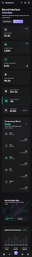 | 780×6106 | Mobile |
| Users Management (Updated) | 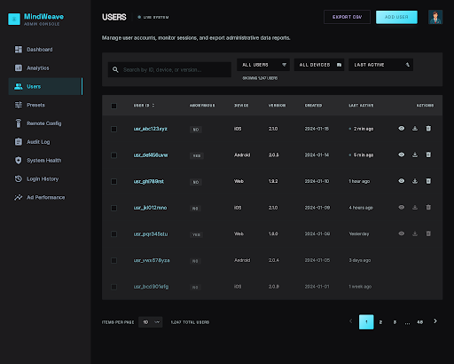 | 2560×2048 | Desktop |
| Audit Log Page | 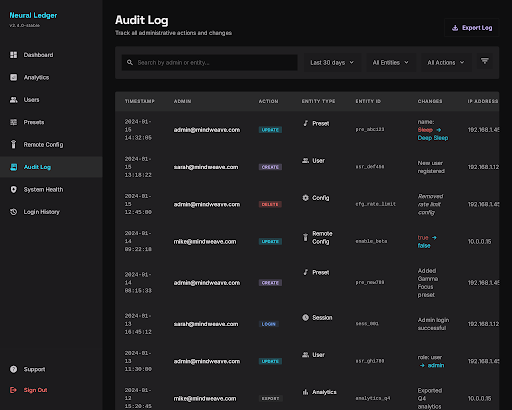 | 2560×2048 | Desktop |
| Remote Config Management | 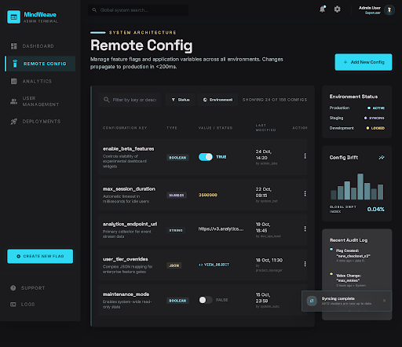 | 2560×2212 | Desktop |
| Presets Management | 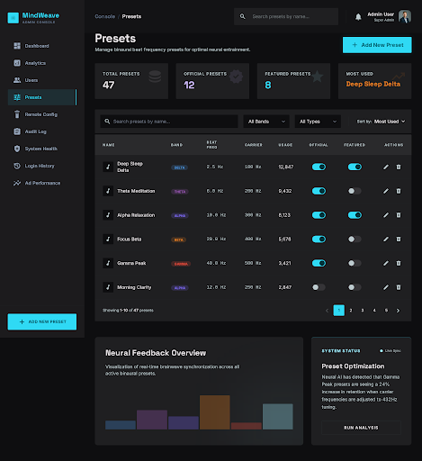 | 2560×2796 | Desktop |
| Notifications Center | 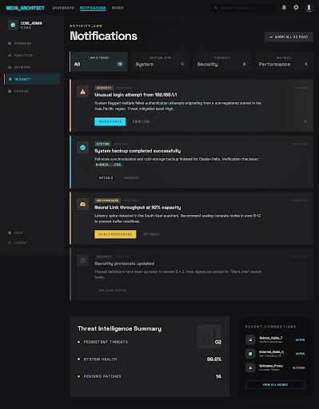 | 2560×3282 | Desktop |
| MindWeave Dashboard (No Sidebar) | 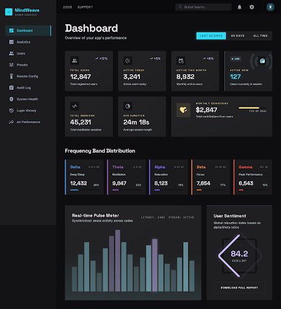 | 2560×2812 | Desktop |
| Analytics Dashboard | 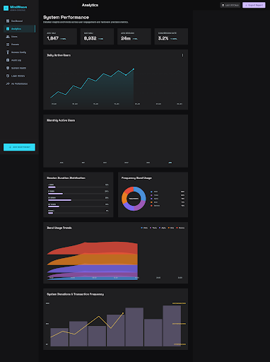 | 3584×4802 | Desktop |
| Analytics Dashboard (Alt) | 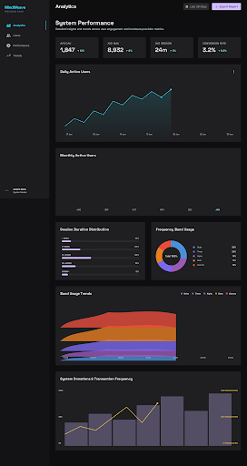 | 2560×4810 | Desktop |
| Login History Page | 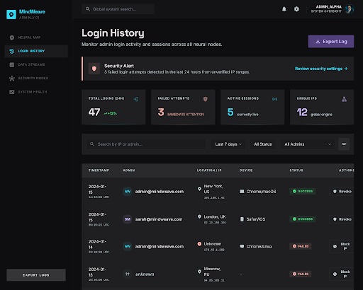 | 2560×2048 | Desktop |
| Presets Management (Alt) | 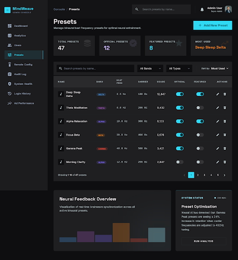 | 2560×2796 | Desktop |
| Admin Settings | 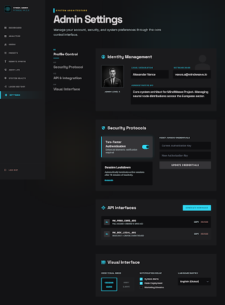 | 2560×3480 | Desktop |
| Users Management (Original) | 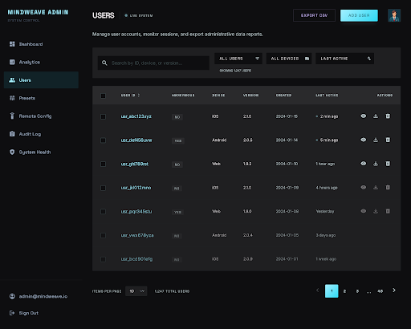 | 2560×2048 | Desktop |
| MindWeave Dashboard Desktop | 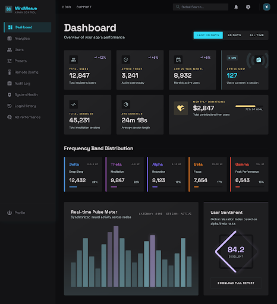 | 2560×2812 | Desktop |
| Remote Config Management (Alt) | 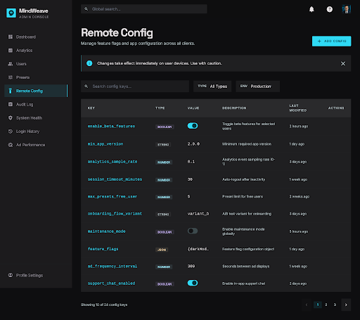 | 2560×2276 | Desktop |
| Analytics Dashboard (Updated) | 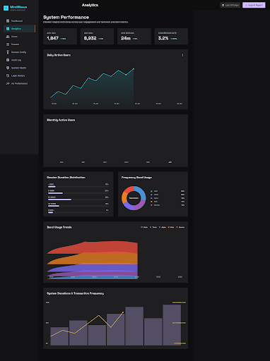 | 3584×4802 | Desktop |
| System Health Monitoring | 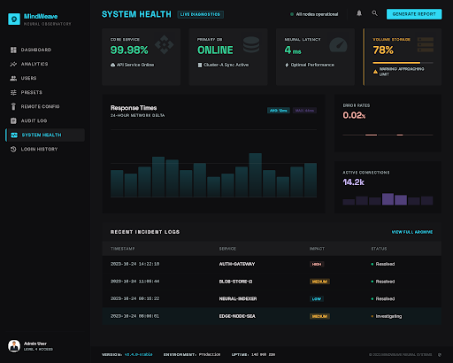 | 2560×2048 | Desktop |
| Updated MindWeave Dashboard | 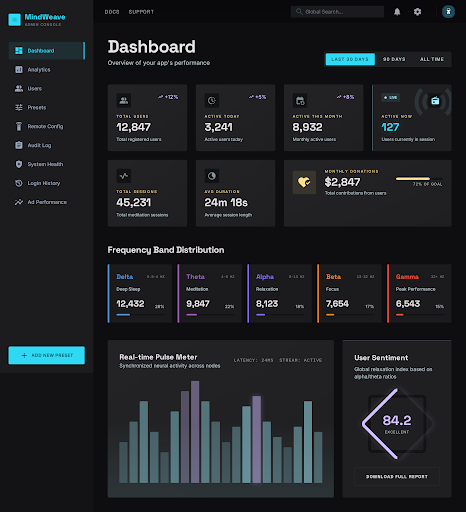 | 2560×2812 | Desktop |
| Login History Page (Alt) | 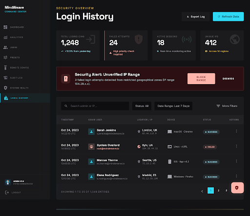 | 2560×2218 | Desktop |

**Total Images Exported:** 19 screen screenshots  
**Location:** `/Users/mey/MindWeave/assets/images/admin-dashboard/`  
**Source:** Stitch MCP Project `1237264908836651755`

---

**Document Status:** Complete component inventory for 46 functional screens
**Next Steps:** Implement global components first, then screen-specific composites
