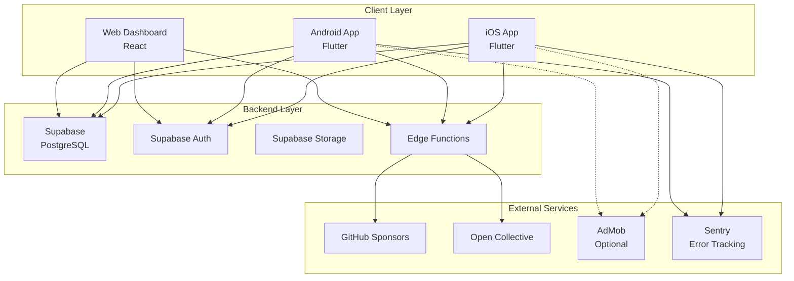
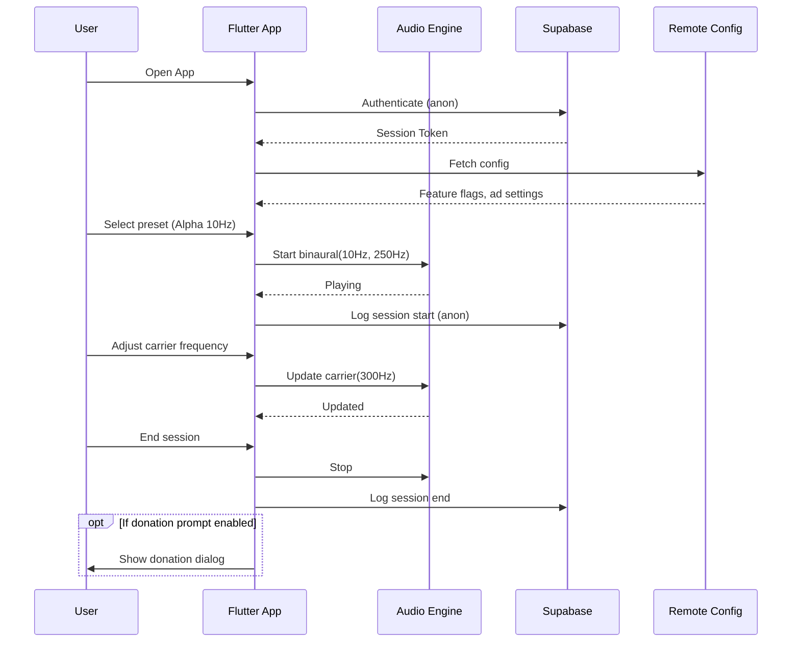
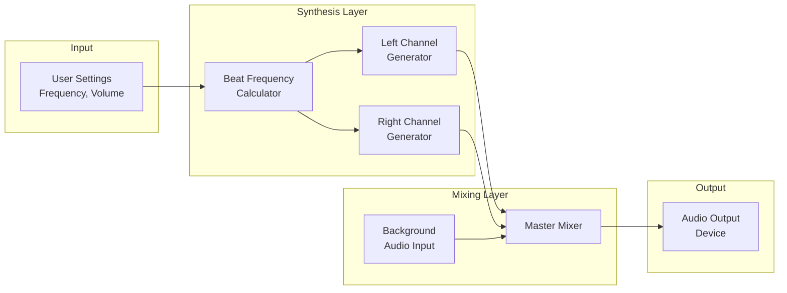
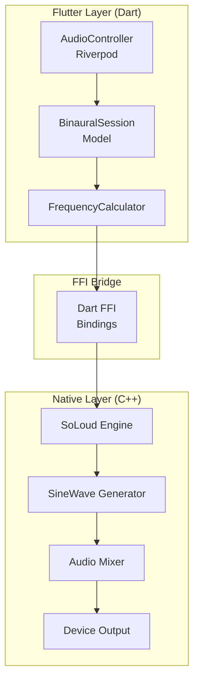
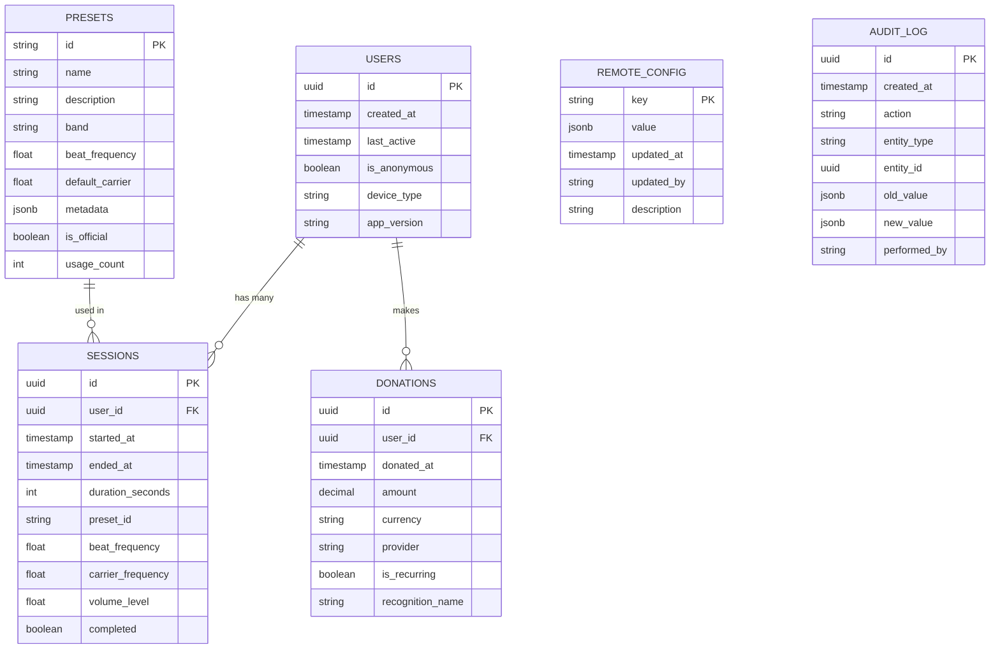
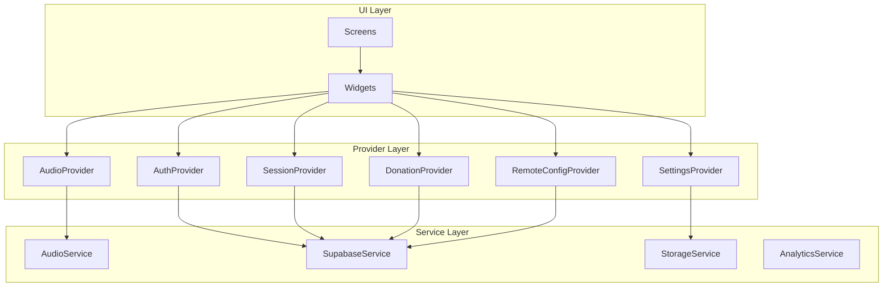
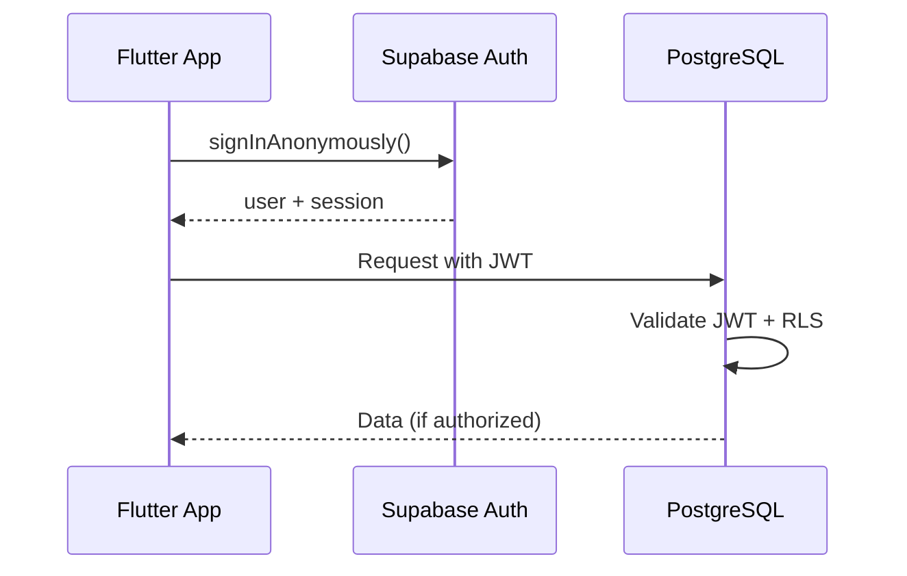
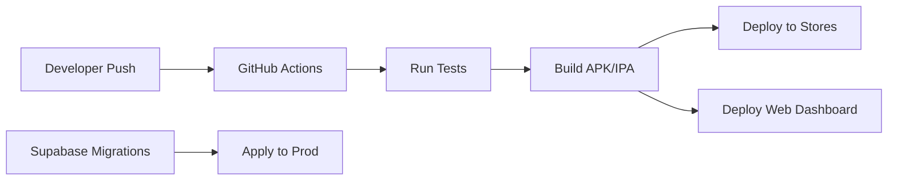

# MindWeave - Technical Specifications Document

## Open Source MindWeave App

**Version:** 1.0  
**Date:** March 28, 2026  
**Status:** Draft for Review  

---

## Table of Contents

1. [Architecture Overview](#1-architecture-overview)
2. [Technology Stack](#2-technology-stack)
3. [Audio Engine Architecture](#3-audio-engine-architecture)
4. [Backend Architecture](#4-backend-architecture)
5. [State Management](#5-state-management)
6. [Data Models](#6-data-models)
7. [API Specifications](#7-api-specifications)
8. [Security Architecture](#8-security-architecture)
9. [Deployment Architecture](#9-deployment-architecture)
10. [Performance Considerations](#10-performance-considerations)

---

## 1. Architecture Overview

### High-Level System Architecture



### Component Interaction Flow



---

## 2. Technology Stack

### 2.1 Frontend (Mobile App)

| Component        | Technology     | Version | Justification                   |
| ---------------- | -------------- | ------- | ------------------------------- |
| Framework        | Flutter        | 3.41+   | Cross-platform, single codebase |
| Language         | Dart           | 3.11+   | Native Flutter performance      |
| State Management | Riverpod       | 2.5+    | Type-safe, testable             |
| Audio            | flutter_soloud | 3.5+    | Low-latency, FFI-based          |
| Local Storage    | Hive           | 2.2+    | Fast, lightweight NoSQL         |
| HTTP Client      | Supabase       | 2.12+   | Direct client (no Dio needed)   |
| Analytics        | (Not used)     | -       | Privacy-focused by default      |

### 2.2 Backend

| Component | Technology | Version | Justification |
|-----------|------------|---------|---------------|
| Platform | Supabase | 1.0+ | Open source, generous free tier |
| Database | PostgreSQL | 15+ | Relational, proven |
| Auth | GoTrue | - | Built into Supabase |
| Functions | Deno Edge | 1.40+ | TypeScript, edge-deployed |
| Real-time | Elixir/Phoenix | - | Built into Supabase |

### 2.3 Admin Dashboard

| Component | Technology | Version | Justification |
|-----------|------------|---------|---------------|
| Framework | React | 18+ | Mature ecosystem |
| Styling | Tailwind CSS | 3.4+ | Rapid development |
| Charts | Recharts | 2.10+ | React-native |
| State | TanStack Query | 5.0+ | Server state management |
| Forms | React Hook Form | 7.50+ | Performance, validation |

### 2.4 DevOps

| Component | Technology | Purpose |
|-----------|------------|---------|
| CI/CD | GitHub Actions | Build, test, deploy |
| Code Quality | Dart Analyze, Lint | Static analysis |
| Testing | Flutter Test, Mockito | Unit/integration tests |
| Monitoring | Sentry | Error tracking (free tier) |

---

## 3. Audio Engine Architecture

### 3.1 Audio Pipeline



### 3.2 Audio Engine Implementation

**Primary Approach: flutter_soloud (FFI to C++)**



### 3.3 Frequency Calculation Logic

```dart
class BinauralFrequencyCalculator {
  /// Calculates left and right channel frequencies
  /// 
  /// [beatFrequency] Target entrainment frequency (0.5-100 Hz)
  /// [carrierFrequency] Base carrier tone (100-500 Hz recommended)
  /// 
  /// Returns tuple of (leftFrequency, rightFrequency)
  static (double, double) calculateFrequencies({
    required double beatFrequency,
    required double carrierFrequency,
  }) {
    // Binaural beat is the difference between left and right
    // We center the carrier and offset by half the beat frequency
    final halfBeat = beatFrequency / 2;
    
    final leftFreq = carrierFrequency - halfBeat;
    final rightFreq = carrierFrequency + halfBeat;
    
    return (leftFreq, rightFreq);
  }
  
  /// Validates frequency parameters
  static bool validateFrequencies({
    required double beatFrequency,
    required double carrierFrequency,
  }) {
    // Beat frequency must be within brainwave ranges
    if (beatFrequency < 0.5 || beatFrequency > 100) return false;
    
    // Carrier must be audible and within optimal range
    if (carrierFrequency < 100 || carrierFrequency > 1000) return false;
    
    // Resulting frequencies must be positive
    final (left, right) = calculateFrequencies(
      beatFrequency: beatFrequency,
      carrierFrequency: carrierFrequency,
    );
    
    return left > 0 && right > 0;
  }
}
```

### 3.4 Audio Preset Configuration

```dart
class BrainwavePreset {
  final String id;
  final String name;
  final String description;
  final BrainwaveBand band;
  final double beatFrequency;
  final double defaultCarrierFrequency;
  final double minCarrierFrequency;
  final double maxCarrierFrequency;
  final IconData icon;
  final Color accentColor;
  final List<String> tags;

  const BrainwavePreset({
    required this.id,
    required this.name,
    required this.description,
    required this.band,
    required this.beatFrequency,
    this.defaultCarrierFrequency = 250.0,
    this.minCarrierFrequency = 100.0,
    this.maxCarrierFrequency = 500.0,
    required this.icon,
    required this.accentColor,
    this.tags = const [],
  });
}

enum BrainwaveBand {
  delta(0.5, 4.0, 'Deep Sleep'),
  theta(4.0, 8.0, 'Meditation'),
  alpha(8.0, 12.0, 'Relaxation'),
  beta(12.0, 30.0, 'Focus'),
  gamma(30.0, 100.0, 'Cognition');

  final double minFreq;
  final double maxFreq;
  final String description;

  const BrainwaveBand(this.minFreq, this.maxFreq, this.description);
}
```

---

## 4. Backend Architecture

### 4.1 Database Schema



### 4.2 Row Level Security (RLS) Policies

```sql
-- Users can only read/update their own data
CREATE POLICY "Users own their data" ON users
    FOR ALL USING (auth.uid() = id);

-- Sessions are viewable only by their owner
CREATE POLICY "Sessions are private" ON sessions
    FOR ALL USING (auth.uid() = user_id);

-- Presets are publicly readable, only admins can modify
CREATE POLICY "Presets are public" ON presets
    FOR SELECT USING (true);

CREATE POLICY "Only admins modify presets" ON presets
    FOR ALL USING (is_admin(auth.uid()));

-- Donations are private to the donor
CREATE POLICY "Donations are private" ON donations
    FOR ALL USING (auth.uid() = user_id);

-- Remote config is publicly readable, admin-only write
CREATE POLICY "Config is public read" ON remote_config
    FOR SELECT USING (true);

CREATE POLICY "Only admins modify config" ON remote_config
    FOR ALL USING (is_admin(auth.uid()));
```

### 4.3 Edge Functions

| Function | Method | Path | Description |
|----------|--------|------|-------------|
| `track-session` | POST | `/functions/v1/track-session` | Log session start/end |
| `get-analytics` | GET | `/functions/v1/analytics` | Admin analytics data |
| `update-config` | POST | `/functions/v1/update-config` | Update remote config |
| `export-data` | POST | `/functions/v1/export-data` | GDPR data export |
| `webhook-donation` | POST | `/functions/v1/webhooks/donation` | Process donation webhooks |

### 4.4 Edge Function Implementation Example

```typescript
// supabase/functions/track-session/index.ts
import { serve } from 'https://deno.land/std@0.168.0/http/server.ts'
import { createClient } from 'https://esm.sh/@supabase/supabase-js@2'

serve(async (req) => {
  const { action, sessionData } = await req.json()
  
  const supabase = createClient(
    Deno.env.get('SUPABASE_URL')!,
    Deno.env.get('SUPABASE_SERVICE_ROLE_KEY')!
  )

  const userId = req.headers.get('x-user-id')
  
  if (action === 'start') {
    const { data, error } = await supabase
      .from('sessions')
      .insert({
        user_id: userId,
        started_at: new Date().toISOString(),
        preset_id: sessionData.presetId,
        beat_frequency: sessionData.beatFrequency,
        carrier_frequency: sessionData.carrierFrequency,
        volume_level: sessionData.volumeLevel,
      })
      .select()
      .single()
    
    return new Response(JSON.stringify({ sessionId: data.id }), {
      headers: { 'Content-Type': 'application/json' },
    })
  }
  
  if (action === 'end') {
    const { error } = await supabase
      .from('sessions')
      .update({
        ended_at: new Date().toISOString(),
        duration_seconds: sessionData.duration,
        completed: sessionData.completed,
      })
      .eq('id', sessionData.sessionId)
    
    return new Response(JSON.stringify({ success: !error }), {
      headers: { 'Content-Type': 'application/json' },
    })
  }
})
```

---

## 5. State Management

### 5.1 App State Architecture



### 5.2 State Providers

```dart
// Audio State
@riverpod
class AudioController extends _$AudioController {
  @override
  AudioState build() {
    return AudioState.initial();
  }

  Future<void> startSession(BinauralConfig config) async {
    state = state.copyWith(status: AudioStatus.initializing);
    
    try {
      await ref.read(audioServiceProvider).start(
        beatFrequency: config.beatFrequency,
        carrierFrequency: config.carrierFrequency,
        volume: config.volume,
      );
      
      state = state.copyWith(
        status: AudioStatus.playing,
        config: config,
        startedAt: DateTime.now(),
      );
      
      // Log session start
      await ref.read(sessionRepositoryProvider).startSession(config);
    } catch (e) {
      state = state.copyWith(
        status: AudioStatus.error,
        errorMessage: e.toString(),
      );
    }
  }

  Future<void> stopSession() async {
    await ref.read(audioServiceProvider).stop();
    
    state = state.copyWith(status: AudioStatus.stopped);
    
    // Log session end
    await ref.read(sessionRepositoryProvider).endSession(
      sessionId: state.sessionId!,
      duration: DateTime.now().difference(state.startedAt!),
    );
  }

  void updateCarrierFrequency(double frequency) {
    ref.read(audioServiceProvider).updateCarrierFrequency(frequency);
    state = state.copyWith(
      config: state.config?.copyWith(carrierFrequency: frequency),
    );
  }
}

// Remote Config State
@riverpod
class RemoteConfigController extends _$RemoteConfigController {
  @override
  Future<RemoteConfig> build() async {
    return await ref.read(remoteConfigRepositoryProvider).fetchConfig();
  }

  bool get adsEnabled => state.value?.adsEnabledGlobally ?? false;
  int get adsUserPercentage => state.value?.adsUserPercentage ?? 0;
  bool get donationPromptEnabled => state.value?.donationPromptEnabled ?? true;
}
```

---

## 6. Data Models

### 6.1 Core Models

```dart
// binaural_config.dart
@freezed
class BinauralConfig with _$BinauralConfig {
  const factory BinauralConfig({
    required String presetId,
    required double beatFrequency,
    required double carrierFrequency,
    @Default(0.7) double volume,
    @Default(null) Duration? timerDuration,
  }) = _BinauralConfig;

  factory BinauralConfig.fromJson(Map<String, dynamic> json) =>
      _$BinauralConfigFromJson(json);
}

// session.dart
@freezed
class Session with _$Session {
  const factory Session({
    required String id,
    required String userId,
    required DateTime startedAt,
    DateTime? endedAt,
    required BinauralConfig config,
    @Default(false) bool completed,
  }) = _Session;

  factory Session.fromJson(Map<String, dynamic> json) =>
      _$SessionFromJson(json);
}

// remote_config.dart
@freezed
class RemoteConfig with _$RemoteConfig {
  const factory RemoteConfig({
    @Default(false) bool adsEnabledGlobally,
    @Default(0) int adsUserPercentage,
    @Default(false) bool adsBannerEnabled,
    @Default(false) bool adsInterstitialEnabled,
    @Default(10) int adsInterstitialFrequency,
    @Default(5) int adsMinSessionsBeforeFirst,
    @Default(true) bool donationPromptEnabled,
    @Default(10) int donationPromptFrequency,
  }) = _RemoteConfig;

  factory RemoteConfig.fromJson(Map<String, dynamic> json) =>
      _$RemoteConfigFromJson(json);
}

// user_settings.dart
@freezed
class UserSettings with _$UserSettings {
  const factory UserSettings({
    @Default(true) bool darkMode,
    @Default(true) bool hapticFeedback,
    @Default(false) bool analyticsEnabled,
    String? defaultPresetId,
    @Default(0.7) double defaultVolume,
    List<String>? favoritePresets,
  }) = _UserSettings;

  factory UserSettings.fromJson(Map<String, dynamic> json) =>
      _$UserSettingsFromJson(json);
}
```

---

## 7. API Specifications

### 7.1 REST API Endpoints

| Endpoint | Method | Auth | Description |
|----------|--------|------|-------------|
| `/rest/v1/sessions` | GET | User | List user's sessions |
| `/rest/v1/sessions` | POST | User | Create new session |
| `/rest/v1/sessions/:id` | PATCH | User | Update session |
| `/rest/v1/presets` | GET | None | List all presets |
| `/rest/v1/presets/:id` | GET | None | Get preset details |
| `/rest/v1/remote_config` | GET | None | Get remote config |
| `/rest/v1/donations` | POST | User | Record donation |

### 7.2 Real-time Subscriptions

```dart
// Subscribe to remote config changes
supabase
    .from('remote_config')
    .stream(primaryKey: ['key'])
    .listen((List<Map<String, dynamic>> data) {
      // Update local config
    });

// Subscribe to new official presets
supabase
    .from('presets')
    .stream(primaryKey: ['id'])
    .eq('is_official', true)
    .listen((List<Map<String, dynamic>> data) {
      // Update preset list
    });
```

---

## 8. Security Architecture

### 8.1 Authentication Flow



### 8.2 Security Measures

| Layer | Measure | Implementation |
|-------|---------|----------------|
| Transport | TLS 1.3 | Supabase enforced |
| Auth | JWT with expiry | Supabase Auth |
| DB | Row Level Security | PostgreSQL RLS |
| API | Rate limiting | Supabase built-in |
| Storage | Signed URLs | Supabase Storage |
| Secrets | Environment variables | GitHub Secrets |

---

## 9. Deployment Architecture

### 9.1 CI/CD Pipeline



### 9.2 Environment Configuration

| Environment | Supabase Project | Usage |
|-------------|------------------|-------|
| Development | `binaural-dev` | Local development |
| Staging | `binaural-staging` | Testing, QA |
| Production | `binaural-prod` | Live app |

### 9.3 GitHub Actions Workflow

```yaml
# .github/workflows/deploy.yml
name: Deploy

on:
  push:
    branches: [main]

jobs:
  test:
    runs-on: ubuntu-latest
    steps:
      - uses: actions/checkout@v4
      - uses: subosito/flutter-action@v2
        with:
          flutter-version: '3.19.0'
      - run: flutter pub get
      - run: flutter analyze
      - run: flutter test

  build-android:
    needs: test
    runs-on: ubuntu-latest
    steps:
      - uses: actions/checkout@v4
      - uses: subosito/flutter-action@v2
      - run: flutter pub get
      - run: flutter build apk --release
      - uses: actions/upload-artifact@v4
        with:
          name: android-release
          path: build/app/outputs/flutter-apk/app-release.apk

  build-ios:
    needs: test
    runs-on: macos-latest
    steps:
      - uses: actions/checkout@v4
      - uses: subosito/flutter-action@v2
      - run: flutter pub get
      - run: flutter build ios --release --no-codesign
```

---

## 10. Performance Considerations

### 10.1 Audio Performance Targets

| Metric | Target | Measurement |
|--------|--------|-------------|
| Audio Latency | < 20ms | From play() to audible |
| CPU Usage | < 5% | During playback |
| Battery Impact | < 3%/hour | Screen off, playing |
| Memory Usage | < 50MB | Audio engine only |

### 10.2 Optimization Strategies

1. **Audio Buffer Size:** Use platform-optimal buffer sizes
   - iOS: 512-1024 samples
   - Android: 192-512 samples (varies by device)

2. **Sample Rate:** Use device-native sample rate to avoid resampling

3. **Background Processing:** Use platform audio services for background playback

4. **Lazy Loading:** Defer non-critical initialization

5. **Caching:** Cache presets and config locally

### 10.3 Monitoring

| Metric | Tool | Alert Threshold |
|--------|------|-----------------|
| Crash Rate | Sentry | > 0.5% |
| ANR Rate | Google Play Console | > 0.3% |
| Audio Dropouts | Custom logging | Any occurrence |
| API Latency | Supabase | > 500ms p95 |

---

## Appendix A: Directory Structure

```
binaural_beats_app/
├── android/                    # Android-specific config
├── ios/                        # iOS-specific config
├── lib/
│   ├── main.dart
│   ├── app.dart
│   ├── src/
│   │   ├── audio/              # Audio engine
│   │   │   ├── audio_controller.dart
│   │   │   ├── audio_service.dart
│   │   │   └── frequency_calculator.dart
│   │   ├── data/               # Data layer
│   │   │   ├── models/
│   │   │   ├── repositories/
│   │   │   └── services/
│   │   ├── presentation/       # UI layer
│   │   │   ├── screens/
│   │   │   ├── widgets/
│   │   │   └── providers/
│   │   └── utils/              # Utilities
│   └── generated/              # Generated files
├── test/                       # Unit tests
├── integration_test/           # Integration tests
├── supabase/                   # Backend
│   ├── migrations/
│   ├── functions/
│   └── seed.sql
├── dashboard/                  # Admin dashboard (React)
└── docs/                       # Documentation
```

---

## Appendix B: Dependencies

```yaml
# pubspec.yaml
name: binaural_beats
description: Open source binaural beats app

environment:
  sdk: '>=3.3.0 <4.0.0'

dependencies:
  flutter:
    sdk: flutter
  
  # State Management
  flutter_riverpod: ^2.5.0
  riverpod_annotation: ^2.3.0
  
  # Audio
  flutter_soloud: ^3.5.4
  audio_session: ^0.1.18
  
  # Backend
  supabase_flutter: ^2.12.0
  
  # Storage
  hive: ^2.2.3
  hive_flutter: ^1.1.0
  
  # UI
  flutter_animate: ^4.5.0
  shimmer: ^3.0.0
  
  # Utils
  freezed_annotation: ^2.4.0
  json_annotation: ^4.8.0
  intl: ^0.19.0
  
  # Additional features
  on_audio_query: ^2.10.0
  flutter_local_notifications: ^21.0.0
  health: ^13.3.1
  posthog_flutter: ^5.23.0
  flutter_dotenv: ^6.0.0
  uuid: ^4.5.3
  device_info_plus: ^12.4.0
  share_plus: ^12.0.2
  
dev_dependencies:
  flutter_test:
    sdk: flutter
  flutter_lints: ^3.0.0
  build_runner: ^2.4.0
  freezed: ^2.4.0
  json_serializable: ^6.7.0
  riverpod_generator: ^2.3.0
  mockito: ^5.4.0
```

---

**Document Approval:**

| Role | Name | Date | Signature |
|------|------|------|-----------|
| Tech Lead | TBD | | |
| Architect | TBD | | |
| Security Review | TBD | | |
